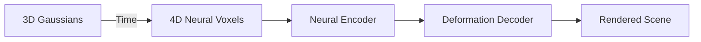

+++
title = "4D Gaussian Splatting: The Tech That Could Make Braindance Real"
date = 2024-07-15
draft = true
tags = ["4DGS", "Computer Vision", "AI"]
+++

I just finished Cyberpunk 2077, and let me tell you; Braindance is the coolest (and creepiest) tech in that game. For the uninitiated: imagine strapping on a headset and reliving someone else's memories, sights, sounds, and all. It's like VR, but on steroids, laced with a shot of existential dread.

But here's the thing: what if I told you we're inching closer to that kind of immersive experience, not with some sci-fi neural implant, but with a wild new graphics technique called **4D Gaussian Splatting** (4DGS)?

## Wait, what is 4D Gaussian Splatting?

Let's break it down. Traditional 3D rendering is like building a Lego city and walking around it. 4DGS? It's like building a Lego city that morphs, dances, and explodes in real time—while you're still walking through it.

4DGS is a new way to represent and render **dynamic scenes**—think moving people, shifting lights, exploding cars—in real time, at high resolution. Instead of rendering each frame separately (like a flipbook), 4DGS encodes both space (3D) and time (the 4th D) into a single, efficient model.

> TL;DR: 4DGS lets you render entire moving scenes, not just static objects, and it does it _fast_.

## How Does It Work? (The "Explain Like I'm Five" Version)

- **3D Gaussians:** Imagine a cloud of glowing orbs (the "splatting"). Each orb holds info about color, position, and size.
- **4D Neural Voxels:** Now, add time to the mix. These orbs can move, stretch, and change as the scene evolves.
- **Neural Magic:** A lightweight neural network predicts how these orbs should morph at any given moment.

Here's a visual to help you out:

(this was taken from the [4DGS demo](https://guanjunwu.github.io/4dgs/), and was taken with a single camera moving through the scene)

## Why Should You Care?

- **Real-Time Rendering:** 4DGS can render dynamic scenes at 30+ FPS, even at high resolutions. That's buttery smooth.
- **Efficient Training:** It learns a whole scene in about 30 minutes. No more waiting hours for your digital world to load.
- **Storage Win:** It's way more compact than storing every frame separately.

### What's Actually Possible Right Now?

- **Dynamic Scene Capture:** Record a real-world event (like a dance battle or a street chase) and replay it from any angle, in real time.
- **VR/AR:** Imagine walking through a memory, not just watching it. (Hello, Braindance!)
- **Film & VFX:** Directors can capture a scene once and tweak the camera path endlessly in post.

## The Future: Braindance, But For Real?

Here's where it gets spicy. If 4DGS keeps improving, we could:

- **Capture and Share Memories:** Relive your birthday party from _any_ perspective.
- **Hyper-Realistic VR:** No more uncanny valley. You're _in_ the scene, not just watching it.
- **AI-Generated Worlds:** Imagine AI dreaming up entire dynamic worlds you can explore, not just static landscapes.

## Hot Takes & Final Thoughts

- 4DGS is the closest thing we've got to real-life Braindance tech. It's not perfect, but it's a hell of a leap.
- The future of VR, film, and even gaming is about to get a lot weirder—and a lot more awesome.
- If you're not excited, you're not paying attention.

> You're still here? Go build something. Or at least go watch the [4DGS demo](https://guanjunwu.github.io/4dgs/). It'll blow your mind.

