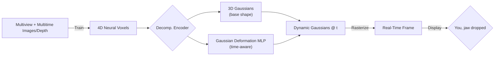

+++
title = "4D Gaussian Splatting, VR^2"
date = 2025-06-12
draft = false
tags = ["4DGS", "Computer Vision", "Future Tech"]
+++

Just binged **Cyberpunk: Edgerunners**. Besides the neon-drenched carnage, one idea wouldn't leave my head: **Braindance**—the hyper-immersive full-sensory recording that lets you relive someone else's memories like you're inside their skull.

> See what they saw. Hear what they heard. Feel what they felt.
>
> —Night City marketing brochure, probably.

Turns out, a real-world tech stack is quietly assembling the building blocks for a _true_ Braindance. Exhibit A: **[4D Gaussian Splatting (4DGS)](https://guanjunwu.github.io/4dgs/)** — fresh out of CVPR 2024 and already frying GPUs in the wild.



## Wait, What's Braindance Again?

For the non-chooms: Braindance (BD) is a fictional recording that captures _everything_—visuals, audio, haptics, even bio-signals—then plays it back so another person can re-experience the scene firsthand. Think VR on nuclear steroids. In Edgerunners, BD rigs record crimes, memories, even someone's last breaths. Viewers scrub through time, pause, zoom, swing the camera anywhere. Total spatial-temporal freedom.

Cool fiction… until you meet 4DGS.

## 4D Gaussian Splatting in Human Words

4DGS is a **dynamic-scene representation** that fuses two ideas:

1. **3D Gaussians** — tiny translucent blobs positioned in space that "splat" colour onto pixels during rendering. (Speedy, thanks to rasterization-friendly math.)
2. **4D Neural Voxels** — a light neural field that encodes _changes over time_.

Combine them and you get a scene that:  
• **Learns in ~30 minutes** on a single RTX 3090.  
• **Renders 30-80 FPS** at 800×800 resolution.  
• Handles complex deformations (humans dancing, cloth flapping) without ballooning storage.

### Pipeline at a Glance

**Why it matters:** Traditional NeRFs look gorgeous but chug at ~1 FPS and take hours to train. 4DGS flips the table: near-instant training, real-time playback, and temporal freedom.

## What Can We Do _Today_?

- **Volumetric video without a render farm.** Point a few commodity cams at a dance performance → 30 min later you have a free-view replay you can orbit in VR.
- **Digital doubles for VFX** on an indie budget. Actors scanned once, animated via real motion capture.
- **Holo-meetings** where remote teammates pop up as living 3D avatars rather than Zoom rectangles.

All this _now_, with open-source code: [GitHub ↗](https://github.com/hustvl/4DGaussians) and the [paper PDF ↗](https://arxiv.org/pdf/2310.08528v2).

## What's Next — Toward Real Braindance

1. **Sensory fusion.** Bolt on high-fidelity audio and haptics to the already-rich visuals.
2. **Edge computing + 6G.** Stream dynamic Gaussian clouds instead of flat video. Lower bandwidth, higher immersion.
3. **Bio-signal capture.** If wearables can log heart rate, galvanic skin response, maybe even neural spikes, we can **record emotions** alongside visuals.
4. **Ethics nightmares.** Consent, deepfake potential, PTSD triggers—same headaches Edgerunners warned us about.

Give the stack 5-10 years and the line between BD fiction and reality gets _real_ blurry.

## 4DGS Explained for Grug Brain 🪨

- Grug see world. World move.
- Grug want magic rock make moving world stay inside tiny box.
- Old magic (NeRF) slow—Grug wait long time, get bored, go hunt mammoth.
- New magic (4DGS) fast—Grug throw many little paint pebbles (Gaussians) in air. Pebbles show color quick.
- Smart tree spirit (MLP) wiggle pebbles when time change.
- Grug happy, dance around fire watching moving world in shiny head-visor.

## TL;DR

4D Gaussian Splatting turns hours-long volumetric capture into lunch-break training and spits out frames faster than your monitor refreshes. Stack it with audio, haptics, and biometric streams, and Braindance stops being dystopian fiction—it becomes an SDK.

