+++
title = "TEMPLATE"
date = 2025-06-13
draft = true
tags = ["TEMPLATE", "TEMPLATE2"]
complexity = "easy"
description = "A compelling, concise description for SEO (under 160 characters). This will appear in search results."
+++

in this example post, I'm going to show you how to use markdown to format your posts.
notice that the title is "TEMPLATE" and the date is 2025-04-16. use the current date in the format YYYY-MM-DD.
also notice that the draft is set to true. this means that the post is not published yet.
after you're done editing, set the draft to false.

**SEO Fields Explained:**

- **description**: This is what appears in Google search results and social media shares. Keep it under 160 characters and make it compelling!
- **image**: Optional featured image for the post. This will be used in social media previews (Open Graph/Twitter Cards). If not set, the site will use the default image.
- **tags**: These become keywords for SEO and help categorize your content.

## Basic Formatting

Want to make your text **stand out**? Use double asterisks or double underscores.
`**Bold text**` or `__also bold__`.

For a bit of _emphasis_, single asterisks or underscores will do the trick.
`*Italic text*` or `_also italic_`.

Need **_both_**? Combine them.
`***Bold and italic***` or `___also bold and italic___.`

To ~~cross something out~~, use double tildes.
`~~Strikethrough text~~`.

## Headings

Structure your content clearly. Use these heading levels:

## Heading 2

### Heading 3

#### Heading 4

Don't bother with these: `# Heading 1`, `##### Heading 5`, `###### Heading 6`. They mess with the hierarchy.

## Lists

### Unordered Lists

Good for itemizing things. Don't overdo it.

- Item 1
- Item 2
  - Nested item 2.1 (use two spaces for indentation)
  - Nested item 2.2
- Item 3

### Task Lists

Keep track of what's done and what's not.

- [x] This task is done.
- [ ] This one's still pending.
- [ ] Another one to go.

## Links

Link to stuff. It's easy.

[This link goes to an external website](https://example.com)
[This one points to another page on this site](/blog/another-post/)

For a more impactful link, make it bold:
[**This is a bold link to something important**](https://github.com/isaaclins/)

## Images

Show, don't just tell. Images are crucial.
Make sure your images are in the `images/` folder. If it's an SVG, put it in `images/svg/`.

This is how you embed a standard image:
``

Example from the Raycast post:
``

And this is for an SVG:
``

Example from the Raycast post:
``

You can even put images inside tables, like in the Raycast post comparing launchers:
``

## Blockquotes

Use blockquotes for quoting someone or emphasizing a block of text.

> This is a blockquote.
> It can span multiple lines.
>
> > Nested blockquotes are also possible. Just add another `>`

## Code Blocks

Show off your code. Use backticks for inline `code`.
For bigger chunks, use triple backticks and specify the language:

```python
# This is a Python code block
print("Hello, World!")
```

```javascript
// This is a JavaScript code block
console.log("Hello, World!");
```

```text
This is a generic text block, good for logs or simple text snippets.
:date -> May 6, 2025
:sig -> ~ ⋖,^><
```

## Tables

Tables are great for comparisons or structured data. Get straight to the point.
The syntax is a bit finicky but powerful. Pay attention to the hyphens for alignment.

```markdown
| Left-aligned Header | Center-aligned Header | Right-aligned Header |
| :------------------ | :-------------------: | -------------------: |
| Content Cell 1      |    Content Cell 2     |       Content Cell 3 |
| Another row         |     And more data     |           Right here |
| Short               |        Medium         | Long content example |
```

Here's a real example from the Raycast post:

```markdown
| Feature                           |  |  |
| --------------------------------- | ----------------------------------------------- | ----------------------------------------------- |
| Customization                     | ⚠️limited                                       | ✅                                              |
| Plugin System                     | ⚠️limited                                       | ⚠️limited                                       |
| Snippets                          | ❌                                              | ✅                                              |
| Clipboard History                 | ✅                                              | ✅                                              |
| Custom links with query insertion | ✅                                              | ✅                                              |
```

And another one:

```markdown
| Credits                                                     |
| ----------------------------------------------------------- |
| [**Raycast**](https://www.raycast.com/)                     |
| [**Flow Launcher**](https://flowlauncher.com/)              |
| [**PowerToys Run**](https://github.com/microsoft/PowerToys) |
```

## Horizontal Rules

Need to visually break up sections? Use three enter key presses.

## Mermaid Diagrams

Mermaid is a powerful tool for creating diagrams using markdown-like syntax. Here are some examples:

### Sequence Diagram

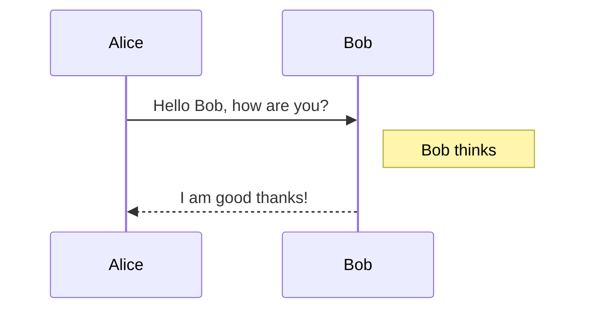

**Best for:** Showing how different parts of a system interact with each other over time. It's great for visualizing the flow of messages or calls between objects or components.

### Gantt Diagram

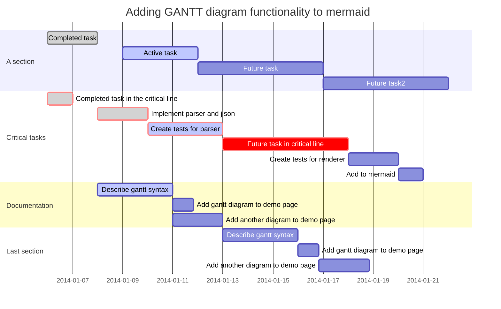

**Best for:** Project management. It helps visualize a project schedule, showing the start and end dates of tasks, as well as their dependencies.

### Class Diagram

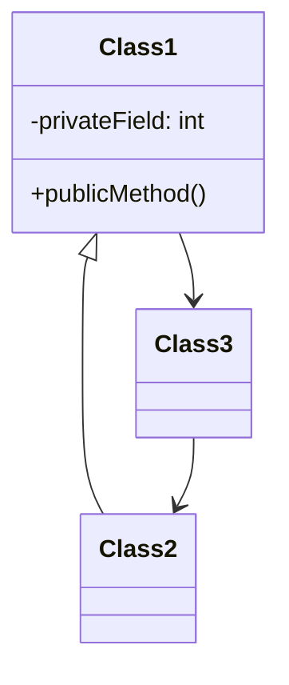

**Best for:** Object-oriented software design. It provides a static view of a system by showing its classes, their attributes, methods, and the relationships between them.

### State Diagram

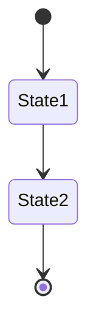

**Best for:** Modeling the behavior of an object. It shows the different states an object can be in and the transitions between those states in response to events.

### Pie Chart

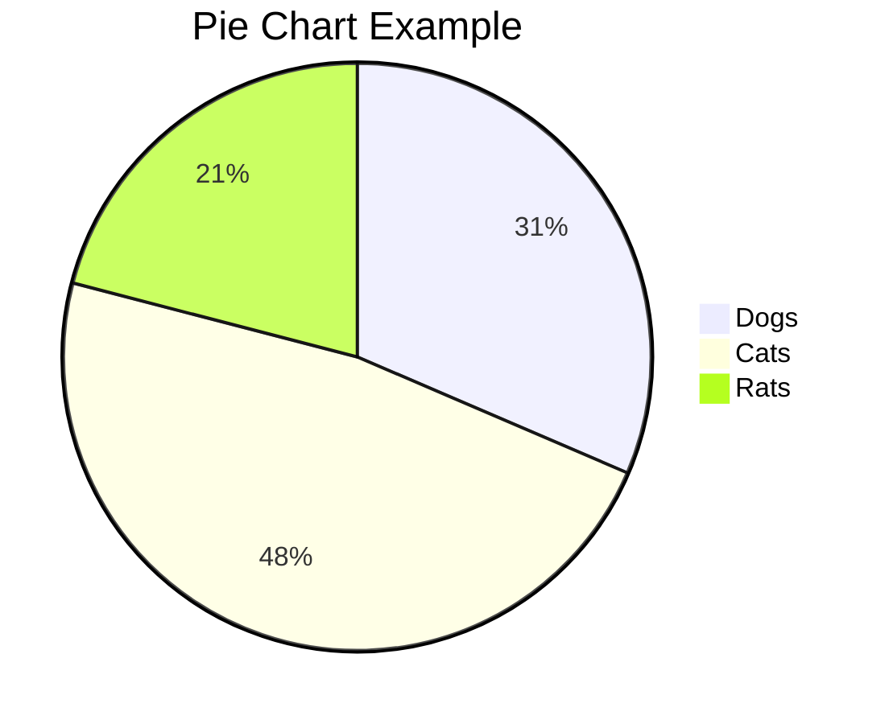

**Best for:** Showing proportions. It's a simple way to visualize how different parts make up a whole.

### Requirement Diagram

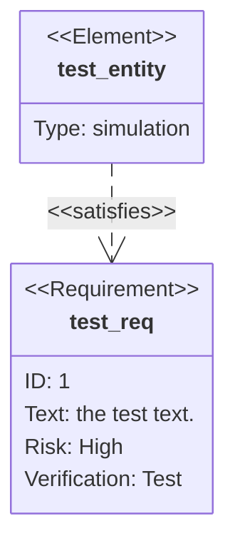

**Best for:** System analysis and design. It helps to visualize requirements and their relationships with other elements, such as components that satisfy them.

### Git Graph

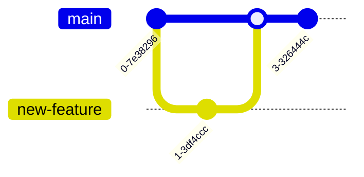

**Best for:** Visualizing Git branching and merging. It makes it easy to understand the history of a repository.

### Mindmap

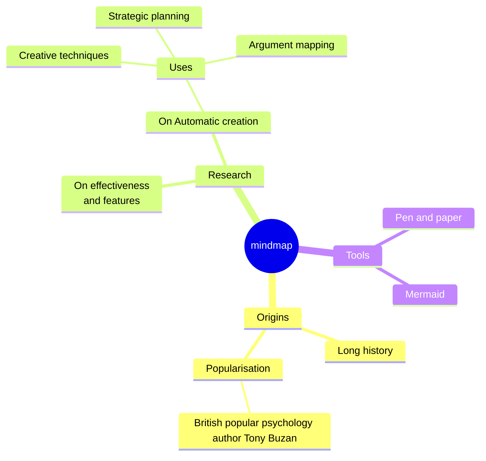

**Best for:** Brainstorming and organizing ideas. It starts with a central concept and branches out into related topics.

### ER Diagram

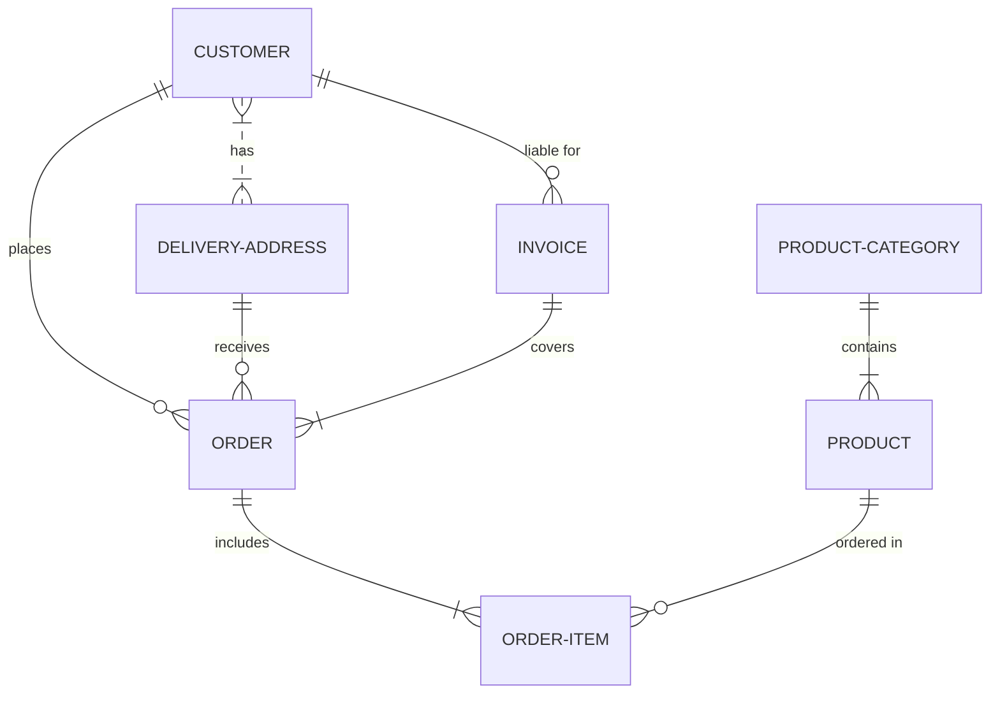

**Best for:** Database design. It shows the relationships between entities (like tables) in a database.

### Quadrant Chart

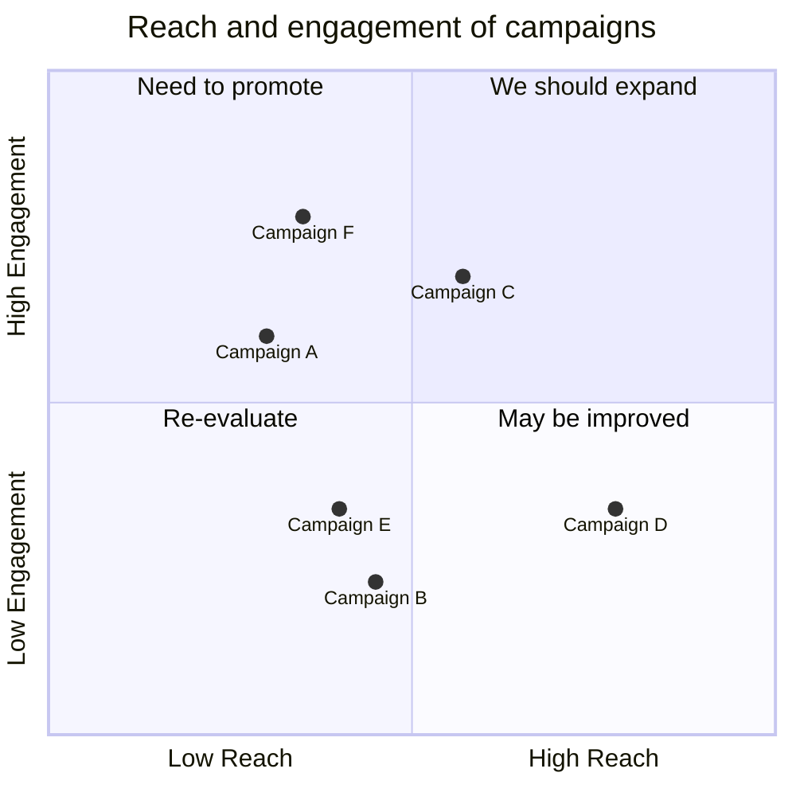

**Best for:** Strategic analysis. It helps to plot data points along two axes, dividing them into four quadrants for easier comparison and decision-making.

### C4 Model

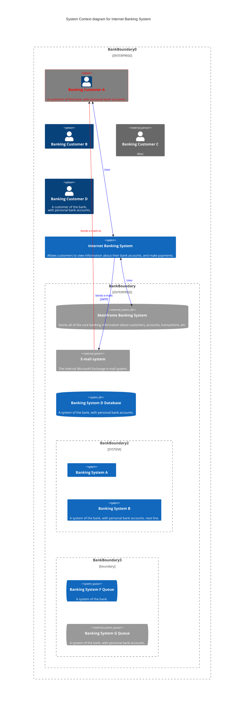

**Best for:** Software architecture visualization. It allows you to describe a system's architecture at different levels of detail (Context, Containers, Components, and Code).

### Sequence Diagram

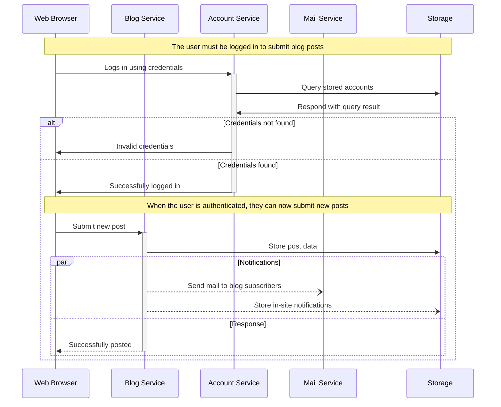

**Best for:** Showing how different parts of a system interact with each other over time. It's great for visualizing the flow of messages or calls between objects or components.

That's the gist of it. Now go write something awesome.
