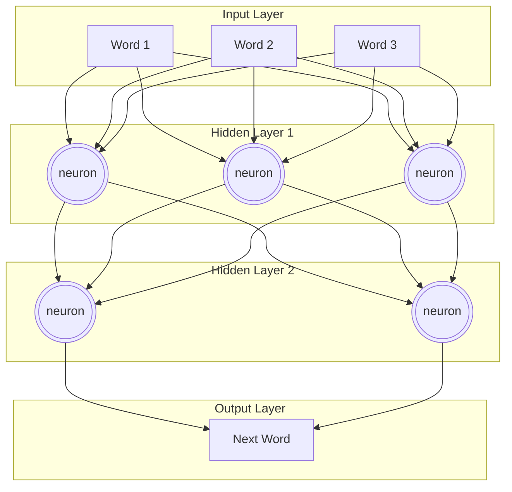
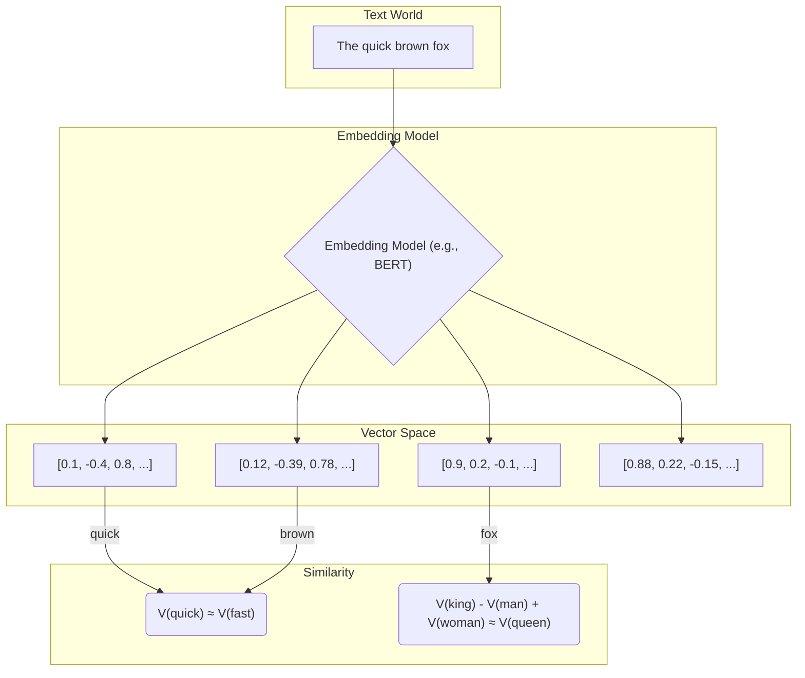
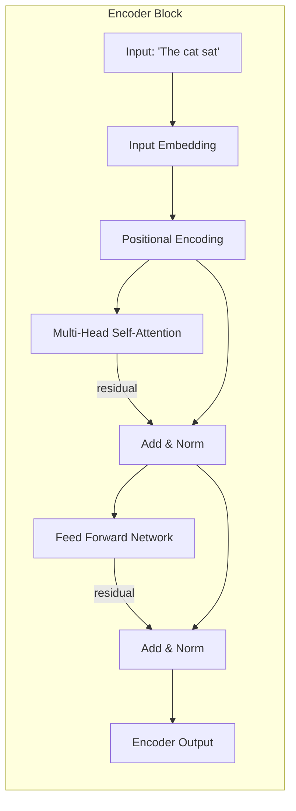
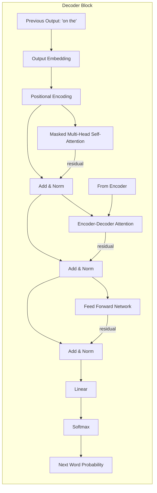
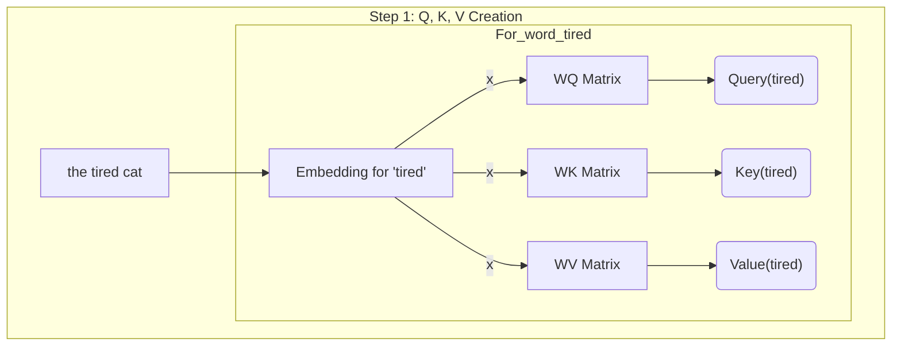
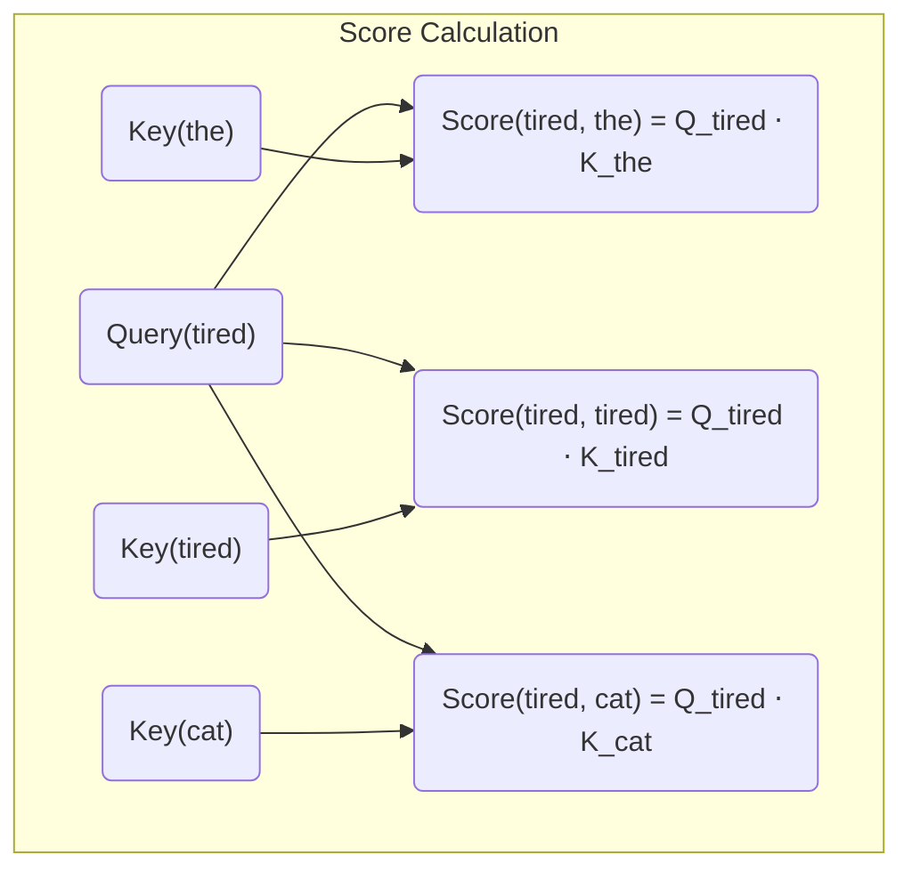
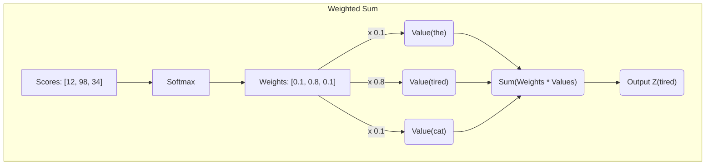

+++
title = "AI is Just Spicy Autocomplete, And You're Falling For It"
date = 2024-07-25
draft = false
tags = ["AI", "LLM", "Tech", "DeepDive"]
+++

You've heard "AI" thrown around more than "synergy" in a corporate brainstorming session. Every startup is "AI-powered," every app has an "AI assistant," and your goddamn toaster is probably next. But if you ask most people what AI actually is, they'll either mumble something about Skynet or point to ChatGPT like it's some digital messiah.

It's not. It's spicy autocomplete. A hyper-advanced version of the thing that tries to finish your sentences in Google Search, and half the time it's hilariously wrong. You're being sold a magic black box, but it's just math. A shit-ton of math, but still just math.

This post is for you, the person who's tired of the buzzwords and the hand-waving. We're going to rip the lid off this thing and see the gears, wires, and probabilistic sludge inside. Buckle up.

## What the Hell is AI, Really? (The Simple Version)

At its core, modern AI, specifically the Large Language Models (LLMs) you interact with, is a prediction engine. Its entire job is to answer one question: **"Given this sequence of words, what's the most likely next word?"**

That's it. That's the whole game.

Imagine you force-fed a toddler the entire internet. Every Wikipedia article, every Reddit comment, every deranged blog post, every line of code on GitHub. Now, you ask that toddler a question. It's not going to "understand" you. It has no concept of truth, or feelings, or the real world. It's just going to regurgitate a sequence of words that statistically resembles the patterns it saw in its training data.

Sometimes, the result is coherent, even brilliant. Other times, it confidently tells you that a horse has six legs and lays eggs. Because somewhere, in the dark corners of the internet it consumed, that pattern seemed plausible.

## How It "Thinks" (The Toddler Brain Analogy)

To do this prediction trick, AI uses something called a **Neural Network**. It's loosely, and I mean _very_ loosely, inspired by the human brain. Think of it less as a brain and more as a gigantic, complicated light switch panel.

Here's a simplified view. You give it input (words), a bunch of internal "neuron" layers flicker on and off, and it produces an output (the next word).

Each connection in that mess has a "weight". A number that determines how much influence one neuron has on the next. The "learning" process is just a brute-force method of adjusting these trillions of weights until the network gets good at predicting the next word in a sentence. It's less "intelligence" and more "tuning a ridiculously complex instrument."

## The Magic Ingredients: Embeddings and Vectors

Okay, but computers don't understand words. They understand numbers. So how does, for example, the concept of a "king" become something a neural network can process?

Through a process called **embedding**. Every word, phrase, or token is mapped to a giant list of numbers called a **vector**. This isn't just a random assignment; the mapping is done in a way that captures semantic meaning.

> note: semantic meaning means the meaning of the word in the context of the sentence.
> For example: "baby" is a word that refers to a very young child, so if I say "My baby is hungry", the word "baby" has a semantic meaning of a young child. but if I say "I have a baby cat", the word "baby" has a semantic meaning of a young cat, depending on the context.

Words with similar meanings will have similar vectors. They'll be "close" to each other in this high-dimensional vector space.

This is the entire basis for "semantic search" and RAG (Retrieval-Augmented Generation). You turn your documents into vectors, store them in a **vector database**, and when a query comes in, you embed the query and find the most similar vectors in your database. It's just finding the closest points on a multidimensional graph. No "understanding" required.

## Transformers

The real revolution wasn't just bigger neural nets; it was a new architecture called the **Transformer**, introduced in a 2017 paper titled "Attention Is All You Need." Heh, nerds, right? But they were onto something.

Before Transformers, models processed text sequentially. This was slow and lost context over long sentences. The Transformer can process all the words in a sentence at once. The key mechanism is **Self-Attention**.

Self-Attention allows the model to weigh the importance of different words in the input text when producing the output. When it's processing the word "it" in the sentence "The cat didn't cross the street because it was tired," attention helps it figure out that "it" refers to "the cat" and not "the street."

Here's a high-level look at the Transformer architecture. It's a beast, so let's look at the two main parts separately: the **Encoder** and the **Decoder**.

First, the **Encoder** stack, which processes the input sequence. Its job is to generate a contextual representation of the input.

Next, the **Decoder** stack takes the Encoder's output and the previously generated output to produce the next word in the sequence.

Let's zoom in on that **Self-Attention** part, because it's the secret sauce. For every word, the model creates three vectors: a **Query (Q)**, a **Key (K)**, and a **Value (V)**. The process can be broken into three main steps.

**Step 1: Create Query, Key, and Value Vectors**

For each word in the input, we generate Q, K, and V vectors. These are learned during training.

**Step 2: Calculate Attention Scores**

Next, we score how much attention the current word should pay to other words. This is done by taking the dot product of the current word's Query vector with the Key vector of every other word.

**Step 3: Get Final Output via Softmax and Weighted Sum**

The scores are normalized using a Softmax function to get weights. These weights are then used to create a weighted sum of all the Value vectors, producing the final output for the current word—a new representation that's rich with context.

This happens for every single word, in parallel. And it happens in multiple "heads," which is just doing this whole process several times with different Q, K, and V matrices to let the model focus on different types of relationships simultaneously. It's a ridiculously complex and computationally expensive way to build context, but it works.

## So, is it "Intelligent"?

No. Fuck no.

An LLM is a pattern-matching machine of unimaginable scale. It has learned the statistical relationships between words in human language. It can generate text that is grammatically correct, contextually relevant, and sometimes even insightful.

But it doesn't _know_ anything. It has no beliefs, no desires, no consciousness. It's a mirror reflecting the vast ocean of text it was trained on. When you ask it to be creative, it's just finding a new, statistically plausible path through the patterns it has memorized.

Stop worshipping the algorithm. It's a tool. A powerful one, for sure, but a tool nonetheless. It's a calculator for words. Use it, leverage it, but for the love of God, don't mistake it for a thinking being.

Now stop reading this and go build something useful with it.
