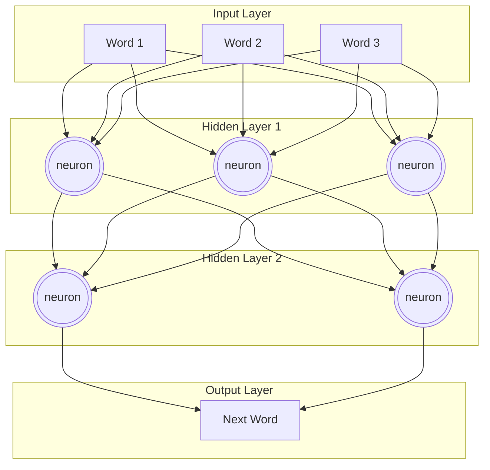
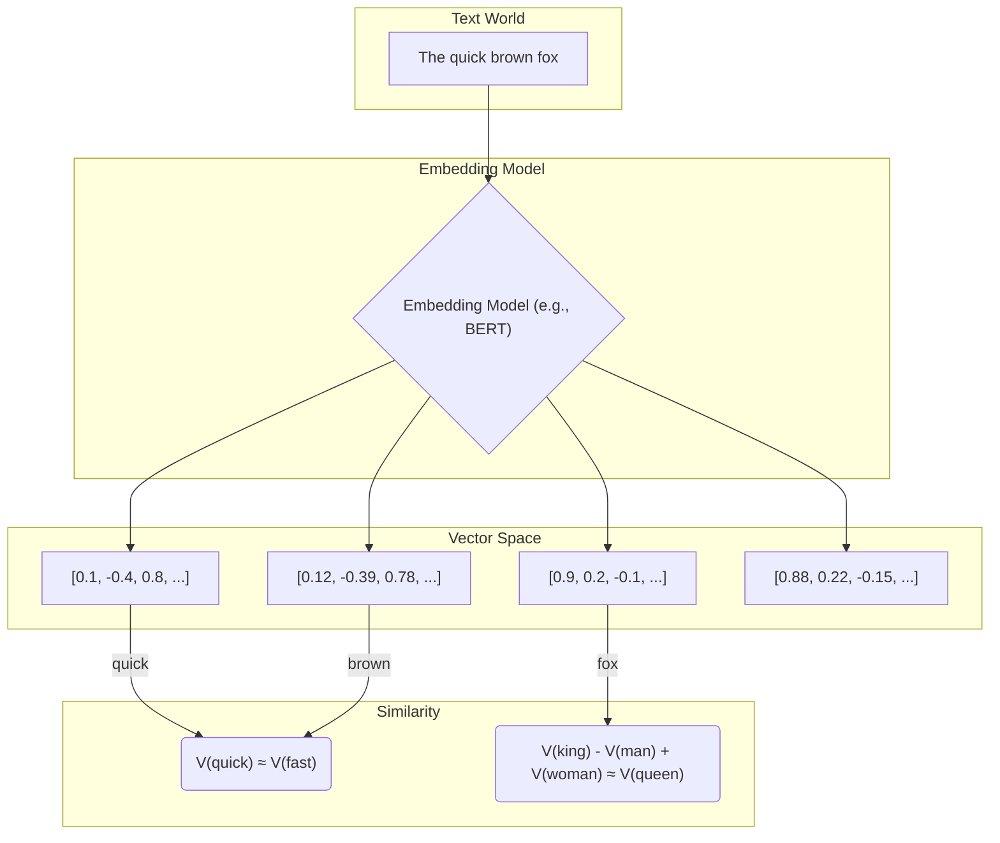
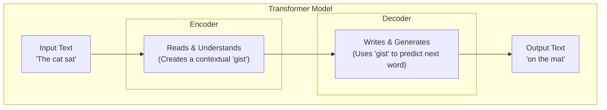
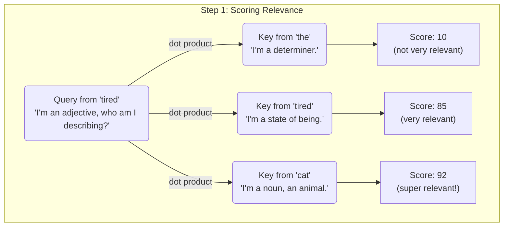
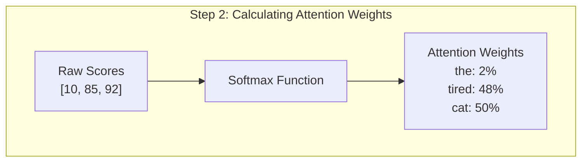
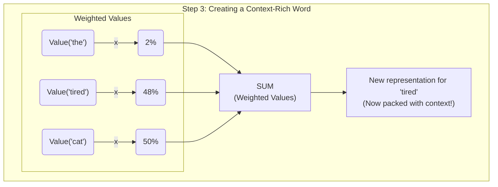

+++
title = "AI is Just Spicy Autocomplete, And You're Falling For It"
date = 2025-06-16
draft = false
tags = ["AI", "LLM", "Tech"]
complexity = "easy"

+++

> NOTE: TAKE THIS POST WITH A GRAIN OF SALT.

You've heard "AI" thrown around more than "synergy" in a corporate brainstorming session. Every startup is "AI-powered", every app has an "AI assistant", and your goddamn toaster is probably next. But if you ask most people what AI actually is, they'll either mumble something about Skynet or point to ChatGPT like it's some digital messiah.

It's not. It's spicy autocomplete. A hyper-advanced version of the thing that tries to finish your sentences in Google Search, and half the time it's hilariously wrong. You're being sold a magic black box, but it's just math. A shit-ton of math, but still just math.

This post is for you, the person who's tired of the buzzwords and the hand-waving. We're going to rip the lid off this thing and see the gears, wires, and probabilistic sludge inside. Buckle up.

## What the Hell is AI, Really? (The Simple Version)

At its core, modern AI, specifically the Large Language Models (LLMs) you interact with, is a prediction engine. Its entire job is to answer one question: **"Given this sequence of words, what's the most likely next word?"**

That's it. That's the whole game.

Imagine you force-fed a toddler the entire internet. Every Wikipedia article, every Reddit comment, every deranged blog post, every line of code on GitHub. Now, you ask that toddler a question. It's not going to "understand" you. It has no concept of truth, or feelings, or the real world. It's just going to regurgitate a sequence of words that statistically resembles the patterns it saw in its training data.

Sometimes, the result is coherent, even brilliant. Other times, it confidently tells you that a horse has six legs and lays eggs. Because somewhere, in the dark corners of the internet it consumed, that pattern seemed plausible.

## How It "Thinks" (The Toddler Brain Analogy)

To do this prediction trick, AI uses something called a **Neural Network**. It's loosely, and I mean _very_ loosely, inspired by the human brain. Think of it less as a brain and more as a gigantic, complicated light switch panel.

Here's a simplified view. You give it input (words), a bunch of internal "neuron" layers flicker on and off, and it produces an output (the next word).

Each connection in that mess has a "weight". A number that determines how much influence one neuron has on the next. The "learning" process is just a brute-force method of adjusting these trillions of weights until the network gets good at predicting the next word in a sentence. It's less "intelligence" and more "tuning a ridiculously complex instrument."

## The Magic Ingredients: Embeddings and Vectors

Okay, but computers don't understand words. They understand numbers. So how does, for example, the concept of a "king" become something a neural network can process?

Through a process called **embedding**. Every word, phrase, or token is mapped to a giant list of numbers called a **vector**. This isn't just a random assignment; the mapping is done in a way that captures semantic meaning.

> note: semantic meaning means the meaning of the word in the context of the sentence.
> > For example: "baby" is a word that refers to a very young child, so if I say "My baby is hungry", the word "baby" has a semantic meaning of a young child. but if I say "I have a baby cat", the word "baby" has a semantic meaning of a young cat, depending on the context.

Words with similar meanings will have similar vectors. They'll be "close" to each other in this high-dimensional vector space.

This is the entire basis for "semantic search" and RAG (Retrieval-Augmented Generation). You turn your documents into vectors, store them in a **vector database**, and when a query comes in, you embed the query and find the most similar vectors in your database. It's just finding the closest points on a multidimensional graph. No "understanding" required.

## The Real Game-Changer: Transformers

The breakthrough that led to the AI you see today wasn't just about making bigger neural networks. It was a new design called the **Transformer**. The geeks who wrote the paper called it "Attention Is All You Need," which is a ballsy title, but they weren't wrong.

Before Transformers, models read text like you'd read a book: one word at a time, from left to right. This was slow as hell and they'd often forget the beginning of a long sentence by the time they reached the end. Sound familiar?

Transformers changed the game by processing **all words in a sentence at once**. The secret sauce is a mechanism called **Self-Attention**. It's how the model figures out which words are most important to "pay attention to" for understanding the context.

When it sees the sentence, "The cat didn't cross the street because **it** was tired," self-attention helps the model know that "**it**" refers to the **cat**, not the street. A small feat for you, a giant leap for machine-kind.

### The Translation Team: Encoder & Decoder

Think of a Transformer as a two-part team for translating ideas.

1.  **The Encoder (The Reader):** Its job is to read the input sentence ("The cat sat") and fully digest it. It doesn't just read the words; it builds a rich, contextual understanding of what the sentence _means_. It's like reading a phrase and getting the "vibe" or "gist" of it. This "gist" is a set of numbers packed with context.

2.  **The Decoder (The Writer):** Its job is to take that "gist" from the Encoder and start writing the output, one word at a time. To decide on the next word, it looks at the Encoder's gist and all the words it has already written.

This structure is why these models are so good at not just predicting the next word, but also at tasks like translation and summarization.

Let's visualize this simplified flow. Don't worry about the gory details, just get the concept.

### The Secret Sauce: Self-Attention (The Cocktail Party Problem)

Okay, so how does this "attention" thing actually work? How does the model know which words are important?

Imagine you're at a loud cocktail party. You're trying to have a conversation. To make sense of anything, your brain is constantly doing three things:

1.  Deciding what you want to focus on (your question).
2.  Scanning the room to see who is talking about that topic.
3.  Listening to what those specific people are saying, while tuning out the rest.

Self-Attention does the same thing, but with words in a sentence. For every single word, it runs this "cocktail party" calculation to build context. To do this, it creates three pieces of information for each word: **Query**, **Key**, and **Value**.

- **Query (Q):** This is your internal question. For the word it's currently processing, the Query is like asking, "What information do I need to understand my own role in this sentence?"
- **Key (K):** This is every other word's "topic." It's like a label that each word holds up, saying, "Here's the kind of information I have!"
- **Value (V):** This is the actual meaning or substance of that word. It's what the word is actually "saying."

The process is a three-step dance. Let's use our sentence: `"the tired cat"`. We're trying to figure out the context for the word `"tired"`.

**Step 1: The 'Query' Meets the 'Keys'**

First, the model's **Query** for `"tired"` goes around and checks the **Key** of every other word (including itself). It's asking, "How relevant are you to me?" It does this with a quick mathematical calculation (a dot product, for you nerds) that spits out a **score**. A high score means high relevance.

The model learns that `"cat"` is highly relevant to `"tired"`. Shocker, I know.

**Step 2: Get the Weights (Who to Listen To)**

The raw scores are messy. The model cleans them up by plugging them into a **Softmax** function. All this does is turn the scores into clean percentages that add up to 100%. These are the "attention weights."

Now, `"tired"` knows exactly how much attention to pay to every other word. It knows to listen mostly to `"cat"` and itself, and pretty much ignore `"the"`.

**Step 3: Create the Final Context (The Payoff)**

The final step is to create a new, context-rich representation for `"tired"`. It does this by taking the **Value** (the actual substance) of every word and multiplying it by its attention weight.

It takes 2% of the `"the"` Value, 48% of the `"tired"` Value, and 50% of the `"cat"` Value. It then sums them all up.

The result is a new vector for `"tired"` that is now deeply aware of its relationship with `"cat"`. This happens for every single word, in parallel. And it happens in multiple "heads," which is just doing this whole party trick several times with different Q, K, and V matrices to let the model focus on different types of relationships simultaneously. It's a ridiculously complex and computationally expensive way to build context, but it works.

So next time someone asks you what AI is, you can tell them:

> AI is just a fancy autocomplete.

> Like when I ask you "The sky is...", you say "blue".

## So, is it "Intelligent"?

No. Fuck no.

Have you even been reading this post?

An LLM is a pattern-matching machine of unimaginable scale. It has learned the statistical relationships between words in human language. It can generate text that is grammatically correct, contextually relevant, and sometimes even insightful.

But it doesn't _know_ anything. It has no beliefs, no desires, no consciousness. It's a mirror reflecting the vast ocean of text it was trained on. When you ask it to be creative, it's just finding a new, statistically plausible path through the patterns it has memorized.

Stop worshipping the algorithm. It's a tool. A powerful one, for sure, but a tool nonetheless. It's a calculator for words. Use it, leverage it, but for the love of God, don't mistake it for a thinking being.

Now stop reading this and go build something useful with it.

## Papers I found helpful

- [The Illustrated Transformer - jalammar](https://jalammar.github.io/illustrated-transformer/)
