```mermaid
graph TD
    subgraph "BitNet B1.58 Brain"
        A("Long-Term Memory<br/>(Weights)<br/>✅ Super Efficient!")
        B("Short-Term Memory<br/>(The 'Notepad')<br/>❌ Still Chunky & Slow")
    end


```

+++
title = "Why You Can't Run ChatGPT on Your Toaster (Yet)"
date = 2025-09-29
draft = false
tags = ["AI", "Tech", "Explained", "LLM"]
complexity = "hard"
toc = true
+++

Here's a weird situation: you can download a state-of-the-art open-source AI model right now. It's free. You can have the entire thing on your hard drive.

But you can't actually run it.

Unless you've got around $400,000 for the kind of computer setup that data centers use, that AI model is just going to sit there. It's like having a Formula 1 car but no racetrack to drive it on.

So what's the solution? Make the AI smaller. Not dumber, just more efficient. This is about how researchers are figuring out how to shrink these massive AI models so they can actually run on normal hardware. Your phone, your laptop, maybe even your car.

### The Size Problem

AI models like ChatGPT have billions of **parameters**, essentially the knobs and dials that make them work. Each parameter is a very precise number, something like `1.23456789`. The model needs billions of these numbers stored with high precision to function properly.

When you ask the AI a question, it does massive amounts of math with all these numbers to generate an answer. Storing billions of precise numbers takes up enormous amounts of space, and doing all that math requires serious computing power.

A typical large model with 7 billion parameters takes up about 14 gigabytes of memory. Most consumer GPUs have 8-12 gigabytes. The model literally doesn't fit. That's the problem.

```mermaid
graph TD
    subgraph "Your Phone"
        direction LR
        C(🧠)
    end
    subgraph "Big AI Model"
        A(🧠🧠🧠🧠🧠🧠<br/>🧠🧠🧠🧠🧠🧠<br/>🧠🧠🧠🧠🧠🧠<br/>...billions more)
    end
    A -- "Way too big!" --> B(💥)
    C -- "Can't fit!" --> B
    style A fill:#ff9999,stroke:#333,stroke-width:2px
    style C fill:#99ccff,stroke:#333,stroke-width:2px
```

 

### First Attempt: Quantization

The first obvious approach is **quantization**, basically just making the numbers less precise. Instead of storing each parameter as a 16-bit number, store it as an 8-bit number. Or even 4-bit.

Think of it like describing a color. With 16 bits, you can be super specific: "a deep crimson with hints of sunset orange." With 8 bits, you might just get "dark red." With 4 bits, it's just "red."

This saves a lot of space. Quantizing from 16-bit to 8-bit cuts the model size in half. That 14 GB model becomes 7 GB, suddenly it fits on your GPU.

The downside? You're rounding off precision. The AI becomes noticeably less accurate. It's a trade-off: smaller size, but reduced quality. You can only compress so much before the model starts giving worse answers.

 

This helps, but it's not ideal. There's a limit to how much you can compress before quality degrades too much.

### A Different Approach: BitNet

Some researchers took a different angle: instead of compressing an existing model, what if you designed one from scratch to be efficient?

That's **BitNet**.

The first version was pretty radical. Instead of parameters being precise decimal numbers, each one could only be **+1** or **-1**. On or off. That's it. This is called a "1-bit" model.

Why does this help? The math becomes incredibly simple. Instead of complex multiplication with decimal numbers, it's just addition and subtraction with +1 and -1. Computers can do this much faster and with way less power consumption.

 

### The Improvement: Adding Zero

The 1-bit approach worked, but there was a problem. With only +1 and -1, every parameter is always contributing something. Sometimes you just want a parameter to do nothing.

So researchers created **BitNet B1.58**, which adds a third option: **0**.

Now each parameter can be **+1**, **-1**, or **0**.

That zero is important. It creates "sparsity", parts of the network can effectively turn off when they're not needed for a specific task. This keeps the efficiency benefits while actually improving the model's accuracy. It's knowing when to contribute and when to stay silent.

(The name B1.58 comes from the fact that encoding three possible states requires about 1.58 bits of information.)

 
### The Results

So does this actually work? Yeah, and the numbers are pretty impressive.

Let's talk about training costs. AI models learn by processing text, measured in **tokens** (roughly words or word pieces). To train a capable model, you need to process trillions of tokens. That requires massive amounts of computation and energy.

Training a standard AI model on a few trillion tokens costs around **$26,000** in compute time.

Training a comparable BitNet model? About **$1,300**.

That's over 20 times cheaper. The simplified math means dramatically lower power consumption, which translates directly to lower costs.

Performance metrics for BitNet compared to standard models:

- **3.5x smaller** memory footprint
- **2.7x faster** inference speed
- **~12x less energy** consumption

The scaling is interesting too. A 70 billion parameter BitNet model is more efficient (faster, smaller, less power) than a standard 13 billion parameter model, while matching its accuracy. You can build bigger models without needing bigger hardware.

 

 

### The Memory Problem

Efficient parameters solve one problem, but there's another: **short-term memory**.

When an AI has a conversation with you, it needs to remember the context of what's been said. This is stored in something called the "KV cache". Essentially the model's working memory.

The original BitNet made the model's weights (parameters) efficient, but the KV cache was still using the old, memory-heavy approach. Long conversations would fill up this cache quickly, limiting how much context the AI could maintain.

 

### Compressing the Cache

Researchers then figured out how to compress the KV cache itself.

By applying similar efficiency techniques to the short-term memory, they achieved **5-12x** better compression. Same amount of memory, but the AI can maintain much longer conversations before hitting the limit.

This matters because context length is crucial for practical applications. You want an AI that can remember the whole conversation, not one that forgets what you said three exchanges ago.

 

### What This Means

This isn't just research. BitNet models are being trained on trillions of tokens right now and matching the performance of models 5x their size. You can actually try them on platforms like Hugging Face.

This is how we get powerful AI running locally on consumer hardware. Your phone running an AI that doesn't need to send data to a server. A car with a smart assistant that works offline. These become possible when models are this efficient.

The interesting part is that current hardware isn't even optimized for BitNet. Today's chips are designed for the complex multiplication that traditional models need. BitNet mostly uses simple addition and subtraction. Once we have chips built specifically for this simpler math, the performance gains will be even larger.

The future of AI isn't just about making bigger models. It's about making them smarter per unit of resources they consume.

What are you doing still reading this? Go build your own BitNet optimized computer.
