```mermaid
graph TD
    subgraph "Your Phone"
        direction LR
        C(🧠)
    end
    subgraph "Big AI Model"
        A(🧠🧠🧠🧠🧠🧠<br/>🧠🧠🧠🧠🧠🧠<br/>🧠🧠🧠🧠🧠🧠<br/>...billions more)
    end
    A -- "Way too big!" --> B(💥)
    C -- "Can't fit!" --> B
    style A fill:#ff9999,stroke:#333,stroke-width:2px
    style C fill:#99ccff,stroke:#333,stroke-width:2px
```

+++
title= "Why You Can't Run ChatGPT on Your Toaster (Yet)"
date= 2025-06-18
draft= true
tags= ["AI", "Tech", "Explained"]
toc = true
+++

Pop quiz.

What's something you can see, you can copy, you can even _have_, but you absolutely **cannot** use?

The answer: a state-of-the-art open-source AI model.

Unless you've got a spare $400,000 lying around for the kind of computer that could power a small country, running your own copy of a top-tier AI is a fantasy. It's like having the blueprints for a starship but being stuck with a bicycle shed for a shipyard.

So, what do we do? We can't all be tech billionaires. The answer, my friends, is to make the AI brains _smaller_. But not dumber. This is the story of how geniuses are trying to shrink AI so it can fit inside your phone, your car, or yes, maybe even your toaster.

### The Big Brain Problem

Think of a huge AI model like ChatGPT as a giant, intricate brain with billions of "neurons" and "synapses." In computer terms, these are called **parameters**. Each parameter is just a number, a very, very specific number, like `1.23456789`. The AI needs billions of these super-precise numbers to be smart.

When you ask the AI a question, it does a fuck-ton of math using all these numbers to give you an answer. Storing these billions of long, precise numbers takes up a massive amount of space, and doing the math requires a ridiculous amount of power.

This is why you can't just download it to your laptop. Your computer would take one look at the file size and simply melt.

 

### Solution 1: Just... Make the Numbers Shorter? (Quantization)

Each of those billions of numbers is usually stored as a "16-bit number." Think of it as describing a color with a super-specific 16-word sentence. It's incredibly precise.

The first big idea to shrink the model was **quantization**. It's like forcing you to describe that same color, but now you can only use 8 words, or 4 words. You lose some of the nuance, right? Instead of "a deep, rich crimson with hints of sunset orange," you might just get "red."

This saves a ton of space. A 7-billion-parameter model, with its numbers stored in 16 bits, takes up about 14 gigabytes. Your fancy gaming computer's video card probably has 8 or 12 gigabytes of memory. The AI brain literally doesn't fit.

By quantizing the numbers to 8-bit, you cut the size in half. The problem? You also make the AI dumber. You're rounding off all the sharp edges of its knowledge. It's a trade-off: a smaller brain, but a foggier one.

 

While this helps, it's not a perfect solution. You can only squeeze it so much before the AI becomes frustratingly stupid. We needed a better, more radical idea.

### A Better Way: Build a Tiny, Efficient Brain from Scratch (BitNet)

Instead of taking a giant, gas-guzzling brain and trying to make it more fuel-efficient, some researchers asked, "What if we designed a brain that was born to be efficient?"

Enter **BitNet**.

The first version of BitNet was extreme. It proposed that every parameter, every "knob" in the AI's brain, could only have two settings: **+1** (ON) or **-1** (OFF-ish, or ON in reverse). That's it. Just two options. This is a "1-bit" model.

The genius of this is that the math becomes ridiculously simple. You don't need complex multiplication anymore. It's all just simple addition and subtraction, which computers can do insanely fast with almost no energy.

 

### The Power of "Meh": Adding Zero

This 1-bit idea was great, but it had a flaw. Sometimes, a neuron just needs to shut up and do nothing. With only +1 and -1, it's always "yelling" something. There's no "off" switch.

So, the researchers came up with **BitNet B1.58**. They introduced a third option: **0**.

Now, each knob in the brain could be **+1 (ON)**, **-1 (REVERSE)**, or **0 (OFF)**.

This was the magic key. That '0' creates "sparsity"—it lets the AI turn off parts of its brain it doesn't need for a specific task. This not only keeps the insane efficiency but also makes the model _smarter_. It's like knowing when to speak and when to stay silent.

_(Why B1.58? Because storing three states requires technically 1.58 bits of information. Nerds.)_

 
### So, Does It Actually Work?

Holy shit, yes. And it's not even close.

The results are mind-blowing. Let's talk about training. How does an AI learn? By reading. A **token** is basically a word or a piece of a word. To get smart, an AI needs to read a library so vast it makes the Library of Alexandria look like a pamphlet—we're talking _trillions_ of tokens.

Processing trillions of tokens costs a horrifying amount of energy. To train a regular AI model on a few trillion tokens might cost, say, **$26,000** for a single training run.

Training a comparable BitNet model? **About $1,300.**

That's not a typo. It's over **20 times cheaper.** Why? Because the math is so much simpler that it sips electricity instead of chugging it.

Here's the final scorecard:

This new BitNet architecture gives you an AI with billions of parameters that is:

- **3.5x smaller** in memory.
- **2.7x faster** to give you an answer.
- Uses about **12 times less energy**.

The most promising part is the scaling law. A **70 billion** parameter BitNet model is more efficient (faster, smaller, less power) than a standard **13 billion** parameter model, while being just as smart.

 

This means we can build bigger, smarter brains without needing bigger, more expensive computers.

 

### The Brain's Other Problem: Amnesia

Okay, so we've made the brain's "knobs" (its long-term memory) super efficient. Problem solved, right? Not quite.

An AI also has **short-term memory**. When you have a conversation, you need to remember what was just said. For an AI, this is called the "KV cache"—think of it as a tiny notepad.

The original BitNet fixed the long-term brain but the notepad was still leaky and inefficient. The longer your conversation, the more notes it had to take, and the notepad would fill up fast, giving the AI amnesia.

```mermaid
graph TD
    subgraph "BitNet B1.58 Brain"
        A("Long-Term Memory<br/>(Weights)<br/>✅ Super Efficient!")
        B("Short-Term Memory<br/>(The 'Notepad')<br/>❌ Still Chunky & Slow")
    end


```

 

### An Even Tinier Brain with a Better Memory

So the researchers went back to the lab. They figured out how to shrink the short-term memory, too.

They invented a way to **super-compress the notepad**.

This is a huge deal. A compressed notepad means the AI can have a much, much longer conversation without running out of memory. We're talking a **5 to 12 times longer** conversation using the same amount of space. It's the difference between an AI that forgets your name after two sentences and one that can remember the entire story you're telling it.

 

### The Future is AI on Your Toaster

This isn't just a science experiment. The latest versions of BitNet are now being trained on trillions of words, and they're proving to be just as good as models 5 times their size. They're even available for people to try out _right now_ on sites like Hugging Face.

This is the path. This is how we get incredibly powerful AI out of the cloud and onto our own devices. An AI that can help you write an email on your phone without sending your data to a server. An AI that can power a smart assistant in your car that doesn't need an internet connection. An AI that can, one day, run on your toaster.

And here's the kicker: we're getting all this incredible performance on computers that are not even _designed_ for this new type of AI. Current chips are built for multiplication. BitNet barely uses it. Once we build new computer chips optimized for BitNet's simple "add/subtract/do nothing" logic, the performance will be even more insane. We're getting a sneak peek of the future running on yesterday's hardware.

So next time you hear about a new, massive AI, don't just ask how big its brain is. Ask how smart it is with the space it's got. The future of AI isn't just bigger; it's a hell of a lot smarter and smaller.
