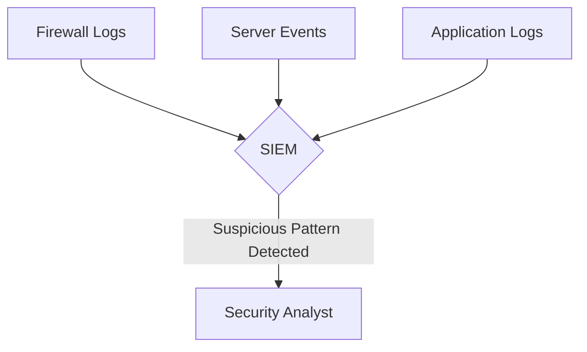
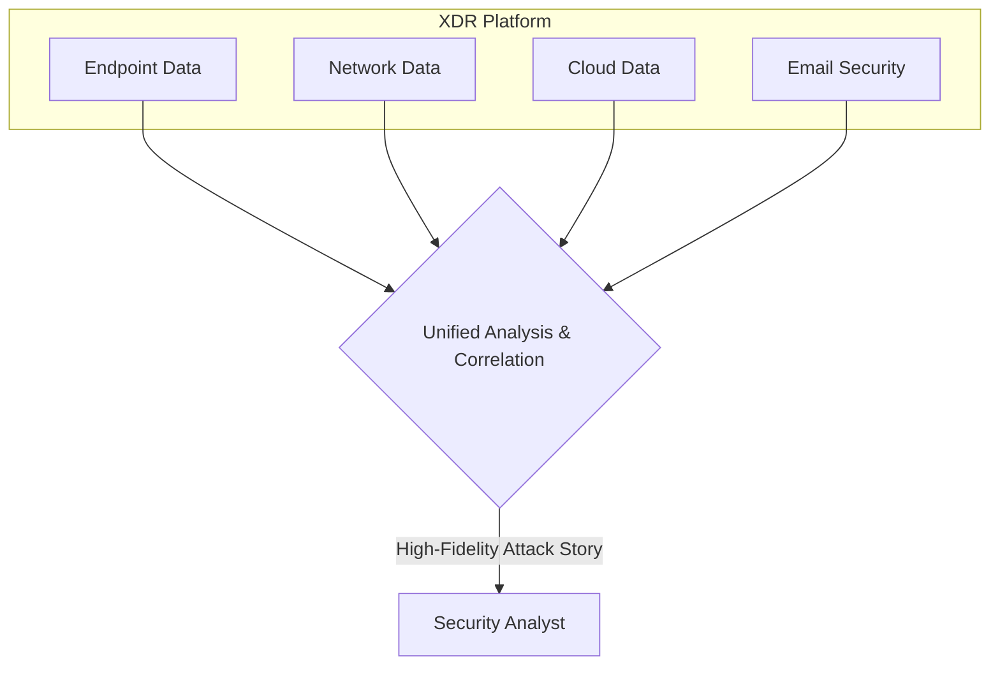

+++
title = "Blue Team: The Basics of Cybersecurity"
date = 2025-09-30
draft = false
tags = ["Security", "Tech"]
complexity = "hard"
+++

So yeah, I'm working in cybersecurity now. Specifically in the 'Blue Team' at my company.

My day-to-day? Staring at screens full of alerts, trying to figure out which ones actually matter. Is this a real threat or did someone just click on a sketchy email again? Most days it's the email.

When I started, everyone was throwing around acronyms like I should already know them. XDR, NDR, EDR, SOAR, SIEM... it was overwhelming. Still is, honestly.

So I'm writing this down as I learn it. If you've ever sat in a meeting nodding along while having no idea what these terms mean, this one's for you. Let's break down what all this stuff actually does.

### The Tools and What They Actually Do

I'll use a castle analogy here because it helps me understand this stuff. Think of your company as a castle—you've got walls, guards, and defenses. Digital security works the same way, just with more acronyms.

#### SIEM: The Central Log Collector

**SIEM = Security Information and Event Management**

SIEM is like a guard in the watchtower logging everything that happens. Every event, every activity, from every part of your network—servers, firewalls, applications, all of it—gets sent to the SIEM.

It collects all these logs and tries to connect the dots to spot potential threats. The challenge? It generates a LOT of noise. You get thousands of events, and most of them aren't actually problems. Learning to filter through that noise is basically the job.

#### EDR: Endpoint Protection

**EDR = Endpoint Detection and Response**

Endpoints are all the devices connected to your network—laptops, phones, servers, tablets. Basically anywhere people are actually working.

EDR monitors what's happening on each of these devices. It's not just looking for known viruses, it's watching for suspicious behavior. If something's trying to install malware, access files it shouldn't, or encrypt your data (ransomware), EDR can catch it and take action—like isolating that device from the network before the problem spreads.

It gives you deep visibility into what's actually happening on each endpoint, which is crucial because that's where a lot of attacks start.

#### NDR: Network Traffic Monitoring

**NDR = Network Detection and Response**

While EDR watches what happens on individual devices, NDR monitors the network traffic between them. It's looking at how devices communicate with each other and with the outside world.

NDR is good at catching things that slip past endpoint security. For example, if a compromised device starts sending unusual amounts of data to an external server, or if something's moving laterally through your network in weird patterns—NDR picks up on that.

It's looking for anomalies in network behavior. Why is this server suddenly talking to this workstation? Why is so much data being transferred at 2 AM? These are the kinds of patterns that can indicate an attack is already underway.

#### XDR: Connecting the Dots

**XDR = Extended Detection and Response**

Here's the thing: you've got SIEM collecting logs, EDR watching endpoints, NDR monitoring network traffic—but they don't always talk to each other well.

XDR brings all that data together into one place. It correlates information from endpoints, network, cloud, email security, everything. So instead of getting separate alerts from different tools, XDR can connect them into a cohesive story.

For example, maybe EDR flags suspicious activity on a laptop, and NDR sees that same laptop sending data to a weird external IP. Separately, those might just be low-priority alerts. Together? That's an actual incident. XDR makes those connections for you, which makes it a lot easier to understand what's actually happening.

#### SOAR: Automating the Response

**SOAR = Security Orchestration, Automation, and Response**

So you've detected a threat. Now what? You could manually handle each incident step by step, but that's slow and inconsistent. That's where SOAR comes in.

SOAR lets you automate common response actions using playbooks. When a specific type of alert comes in, SOAR can automatically execute a series of steps.

Example: A phishing email is detected. SOAR can automatically:

1.  Quarantine the email
2.  Block the sender's IP on the firewall
3.  Check other mailboxes for the same email
4.  Create a ticket for an analyst to review

It handles the repetitive stuff so analysts can focus on more complex investigations. Makes responses faster and more consistent across the team.

### What It's Actually Like

So that's the theory. In practice, my job is sorting through alerts from all these systems and figuring out what actually needs attention. Most days it's filtering through noise to find the few things that matter.

It's a lot of learning. There's always something new to understand, some new attack pattern or tool configuration. But it's interesting work. You're essentially trying to think like an attacker while building defenses.

If you're considering getting into this field, just know there's a steep learning curve. You'll feel lost at first, and that's normal. Everyone does. The terminology alone takes time to absorb.

Anyway, I've got alerts to check.
