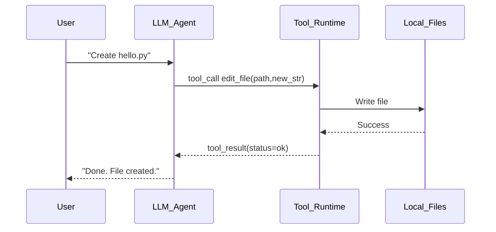
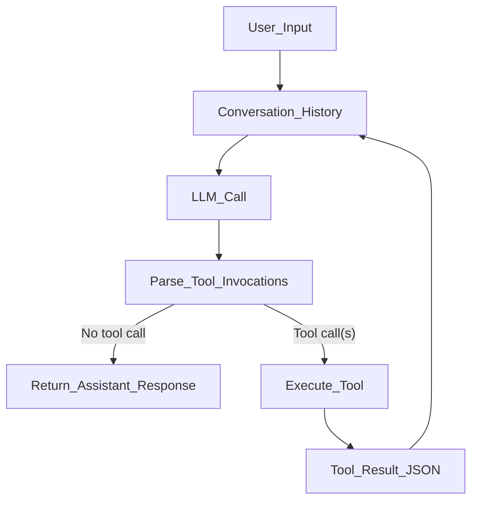
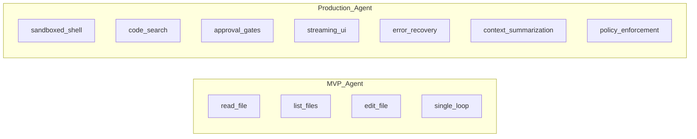

+++
title = "Building a Codex-Style Coding App"
date = 2026-04-14
draft = false
tags = ["AI", "Coding Agents", "Dev"]
complexity = "medium"
description = "Build a Codex-style AI coding app with tool calling, file edits, and an agent loop in about 200 lines."
+++

AI coding assistants feel like black magic until you peek under the hood.

Then you realize the "magic" is mostly a loop:

1. User asks for something.
2. Model asks for a tool.
3. Runtime executes tool.
4. Tool result goes back to model.
5. Repeat until done.

Congrats. You now understand the core of modern coding agents.

This post is heavily inspired by Theo from t4.gg, specifically this video:
[Building a Codex-Style Coding App (Theo)](https://www.youtube.com/watch?v=I82j7AzMU80).

This post is also inspired by Mihail Eric's write-up on building a functional coding agent in around 200 lines, and yes, the emperor really does have no clothes:
[The Emperor Has No Clothes: How to Code Claude Code in 200 Lines of Code](https://www.mihaileric.com/The-Emperor-Has-No-Clothes/).

## The Core Loop (No Hype Version)

You don't need a 400-slide architecture deck. You need one clean loop.

The model never directly edits your filesystem. It requests actions. Your runtime performs them. That's the safety boundary.

## Three Tools Are Enough to Start

For an MVP, you only need:

- `read_file`: lets the model inspect code before changing it.
- `list_files`: lets it navigate your project without guessing paths.
- `edit_file`: lets it create or patch files.

Yes, production tools add shell, search, web, diffs, approvals, and guardrails. But these three get you surprisingly far before things get spicy.

## Minimal Architecture

Here's the whole thing at a high level:

If you can implement this graph, you can build a Codex-style app.

## The Important Parts You Can't Skip

### 1) Tool registry

Map tool names to actual functions. Keep it boring and explicit.

### 2) Clear tool descriptions

Your model chooses tools using the metadata you provide. Weak descriptions = confused model = cursed output.

### 3) Deterministic tool call format

Use strict JSON for tool args. Parse hard, fail loud, retry safely.

### 4) Conversation state

Every tool result should go back into the same message history. If you drop context, your agent gets amnesia and starts hallucinating paths.

## MVP vs Real-World Agent

MVP gets you a demo.
Production gets you reliability, safety, and fewer 3am incidents.

## Common Mistakes (That Will Hurt You)

- Letting `edit_file` do blind replacements without checking unique matches.
- Allowing arbitrary shell commands before implementing approvals.
- Forgetting path normalization and accidentally writing outside project root.
- Returning vague tool errors ("failed") instead of structured details.
- Skipping request IDs, then suffering in logs when something loops forever.

## A Practical Build Plan

If you're building this today:

1. Implement `read_file`, `list_files`, `edit_file`.
2. Add a strict tool invocation parser.
3. Implement the nested loop: call model -> execute tools -> append results -> repeat.
4. Add guardrails (path scope, max iterations, timeout).
5. Add UX sugar (streaming output, better errors, dry-run mode).

Do not start with multi-agent orchestration. That's like installing a spoiler on a bike.

## Why This Matters

The big unlock is not "AI writes code."
The unlock is "models can reliably operate tools inside a constrained runtime."

That turns an LLM from a chat box into an operator.

And once you get that, you stop treating coding agents like wizardry and start treating them like systems engineering.

## Final Take

Building a Codex-style coding app is not easy, but the core is simple.
Simple is good. Simple ships.

Start with the 200-line mental model, then harden it one guardrail at a time.
Stop overcomplicating it. Go build the thing.

## Credits

- Major inspiration:
  [Theo at t4.gg - YouTube video](https://www.youtube.com/watch?v=I82j7AzMU80)
- Original inspiration and technical walkthrough:
  [The Emperor Has No Clothes: How to Code Claude Code in 200 Lines of Code](https://www.mihaileric.com/The-Emperor-Has-No-Clothes/)
