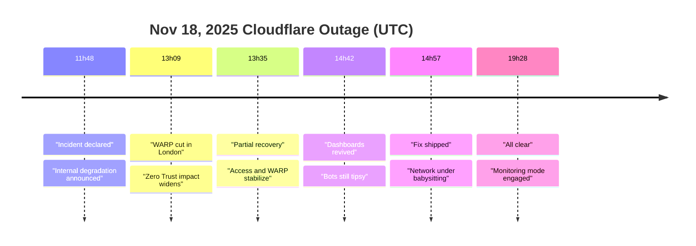
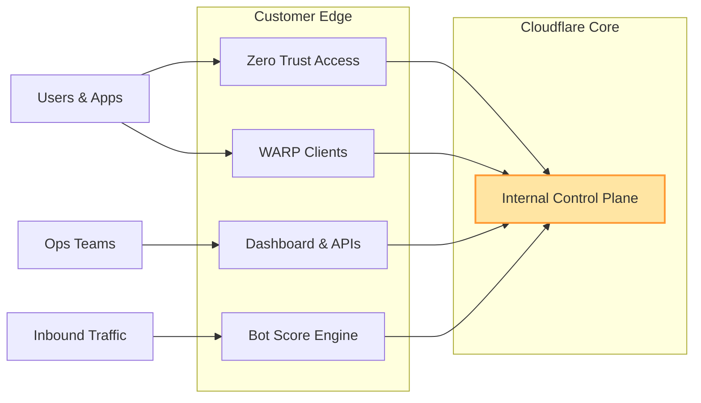
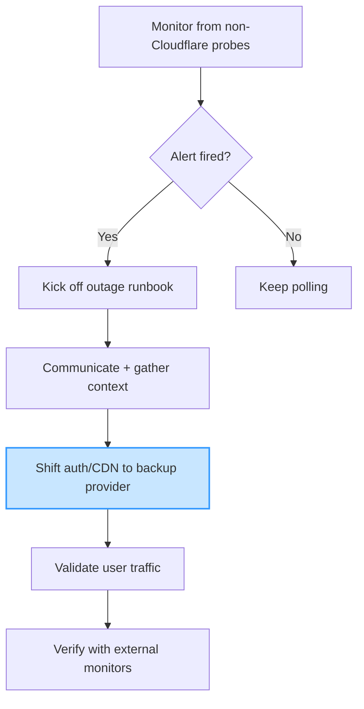

+++
title = "Cloudflare Took a Sick Day"
date = 2025-11-19
draft = false
tags = ["Cloudflare", "Incident Response", "Zero Trust", "SRE"]
complexity = "medium"
description = "Cloudflare's Nov 18 outage knocked dashboards, WARP, and Access offline worldwide—here's what broke and how to harden your own stack."
+++

([source](https://www.reddit.com/r/ChatGPT/comments/1p0a5ef/what_the_heck_is_this/))

Cloudflare sneezed on November 18 and half the internet reached for the tissues. At **11:48 UTC** they flagged an "internal service degradation" that spiraled into dashboard failures, busted API calls, and Zero Trust policies (the "never trust, always verify" gatekeeper Cloudflare uses) locking out legit users.[^status]

### The play-by-play (UTC)

- **11:48** – Incident declared; dashboards, APIs, and security services start flaking out.
- **13:09** – Cloudflare disables [WARP](https://developers.cloudflare.com/cloudflare-one/team-and-resources/devices/warp/) in London to stem the bleeding, because nothing says "global network" like turning off the always-on device client that funnels traffic into their network.[^status]
- **13:35** – Access and WARP begin crawling back, but application traffic is still tripping over itself.
- **14:42** – Dashboard comes back, yet bot scores and Zero Trust checks are still drunk.
- **14:57** – Fix deployed; engineers babysit the network like it's a Windows 98 defrag window.
- **19:28** – Final update: everything's stable, nothing to see here, move along.

#### Timeline (chart)

### What actually hurt

Cloudflare's post says "internal service degradation" but the real pain showed up in the chain reaction:

- WARP clients couldn't connect, so remote workers got the joy of emailing IT from their phones.
- Zero Trust Access freaked out and failed closed—great for security, brutal for productivity when your app gatekeeper slams shut.
- Dashboard and APIs threw errors, so ops teams were stuck blindly trusting existing rules.
- Bot scores (Cloudflare's "is this a bot?" meter) went sideways, meaning whatever protections you dialed in for scripts and scrapers were suddenly vibes-based.

If that sounds familiar, it's because we already talked about their June faceplant and the danger of trusting a single service hub too much.

> [Read that rant for the receipts.](/blog/cloudflare-outage-postmortem/)

### Why you should care (even if nothing exploded on your side)

Cloudflare sits between your users and everything remotely interesting. When they stumble:

- **Zero Trust stalls**: If your auth, device posture, or SWG checks hinge on Cloudflare's verification stack, your runbook needs a Plan B.
- **Observability goes fuzzy**: Status pages and dashboards were laggy; you need your own probes running from multiple networks (Cloudflare-free ones included).
- **Automation stops trusting itself**: CI/CD hooks, webhook-triggered workflows, and API-driven deployments all lost their babysitter for a few hours once the API started wheezing.

### So what now?

1. **Audit fail-safes** – Make sure your Zero Trust stack can fall back to another identity provider or sandbox vendor when Cloudflare sneezes.
2. **Add third-party monitors** – If all your heartbeats ride through 1.1.1.1 (Cloudflare's public DNS), you're checking your pulse with Cloudflare's hand.
3. **Script status exports** – Pull their status API into your own logging so you can correlate future oopsies without waiting for a blog post.
4. **Rehearse the "Cloudflare is down" play** – Have a runbook for bypassing CDN, shifting DNS, or flipping to a secondary tunnel. And actually rehearse it; muscle memory beats panic.

You're still here? Go build the boring automation that lets you sleep when the internet's favorite hall monitor calls in sick.

[^status]: Cloudflare Status – _Cloudflare Global Network experiencing issues_ (Nov 18, 2025) [https://www.cloudflarestatus.com/incidents/8gmgl950y3h7](https://www.cloudflarestatus.com/incidents/8gmgl950y3h7)
