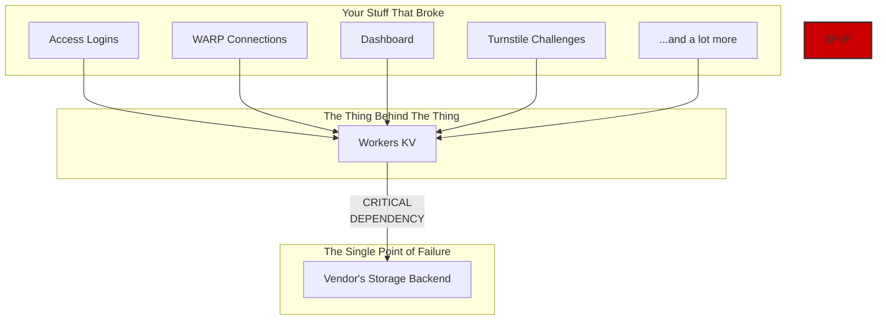
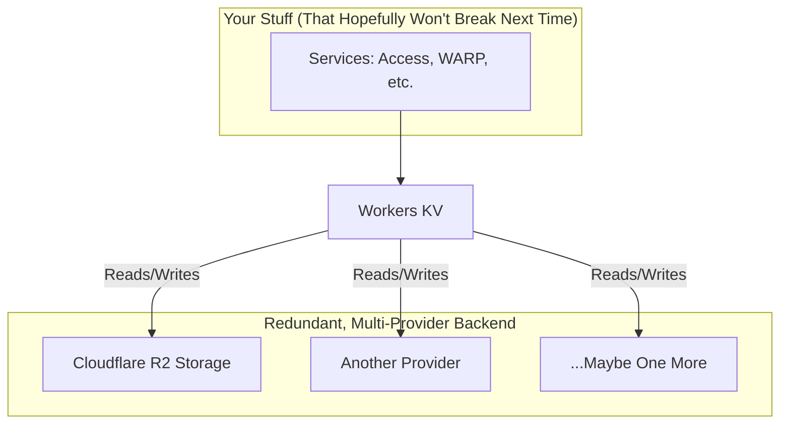

+++
title = "So, Cloudflare Shit the Bed. What Now?"
date = 2025-06-17
draft = false
tags = ["Cloudflare", "Outage", "Postmortem", "SysAdmin"]
+++

Yep, it happened. On June 12, 2025, Cloudflare—the company that's supposed to _prevent_ your website from going down, went down. Hard. For 2 hours and 28 minutes, a significant chunk of their services were on a coffee break, taking a portion of the internet with them.

If your dashboard was dead, your logins failed, or your precious serverless functions went poof, you weren't alone. It wasn't a DDoS attack. It wasn't some elite hacker group. The cause was simpler, and frankly, a little more embarrassing.

### The Single Point of Oof

Cloudflare's post-mortem was refreshingly honest: they leaned on a single third-party storage provider for their critical `Workers KV` service. And `Workers KV` isn't just some side-project; it's the backbone for a ton of their other products.

Think of it like this: you have a skyscraper (Cloudflare services) built on a super-advanced foundation (Workers KV). But that entire foundation is resting on a single, tiny jack stand (the third-party provider). When that jack stand wobbled, the whole damn building shook.

It's the classic XKCD problem, and it turns out even Cloudflare isn't immune.

Here's a visual for you.

When the `Third-Party Storage` went offline, `Workers KV` couldn't read its data. As a result, every service relying on it started throwing errors. Access couldn't verify users, WARP couldn't connect new clients, and even the Dashboard couldn't log people in. A classic cascading failure.

### How They're Mopping Up the Mess

Credit where it's due: Cloudflare didn't hide. Their blog post was detailed and they took full responsibility. They're not just pointing fingers; they're re-architecting.

Their plan is to stop using a single provider for `Workers KV`'s backend. They're moving to a multi-provider, redundant setup, which includes their own R2 storage. In other words, they're finally building more jack stands.

Here's the "after" picture they're painting:

This looks a hell of a lot better. No single vendor outage should be able to take down this many core services.

### The Takeaway? Don't Get Complacent.

This is a brutal lesson in system architecture for everyone, not just Cloudflare.

1.  **Audit Your Dependencies:** Do you _really_ know what your critical services rely on? Go check. Right now.
2.  **Eliminate Single Points of Failure:** If one component failing can nuke your whole operation, you have a problem.
3.  **Fail Open or Fail Closed?** Cloudflare's Access and Gateway services "failed closed," meaning they blocked traffic rather than letting it through insecurely. That was the right call, but it highlights the need for robust fallbacks.

So, what now? You're still here? Go review your own infrastructure. Assume something will fail tomorrow. What happens? If the answer is "everything catches fire," you've got work to do. Don't wait for your own post-mortem to figure it out.
