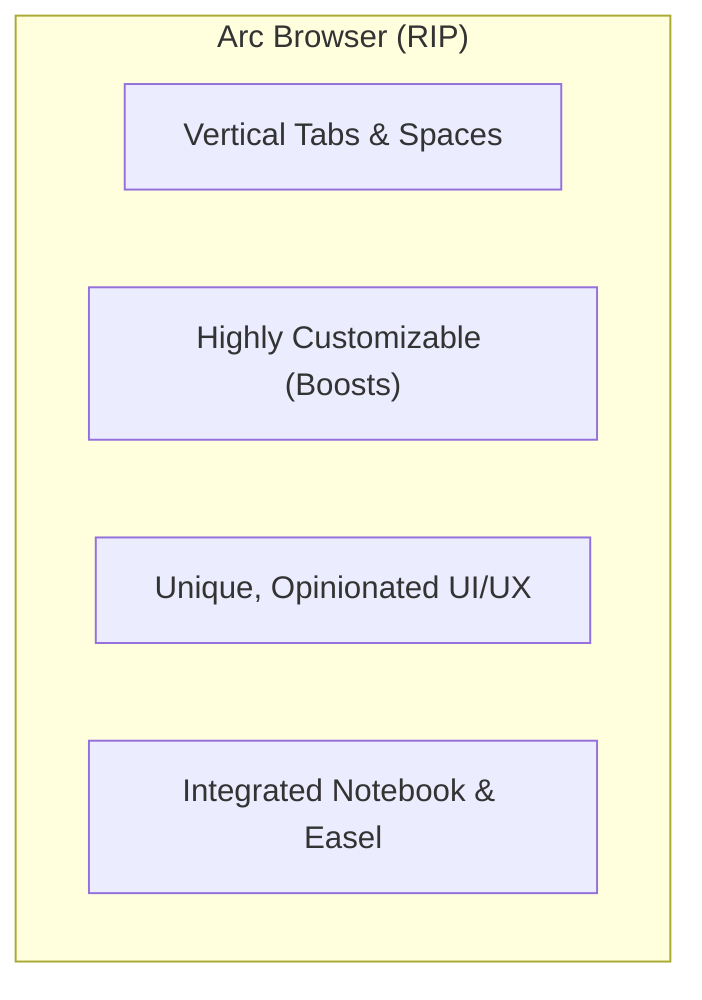
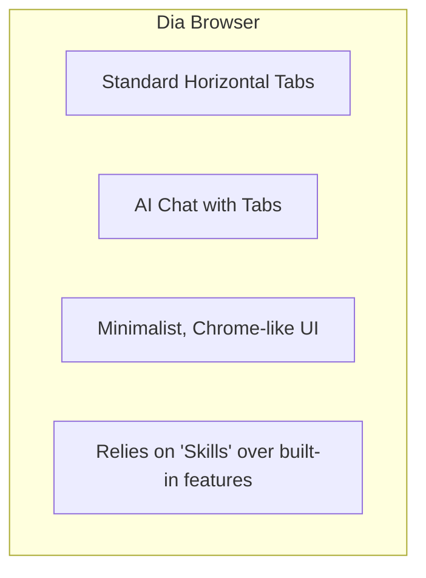
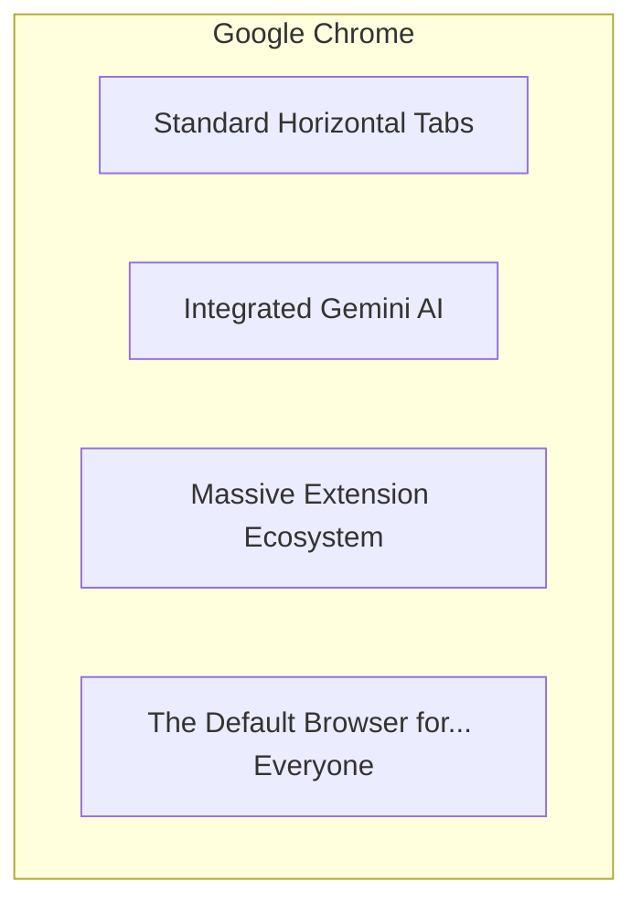

+++
title= "So Long, Arc. Did The Browser Company Sell Its Soul for Dia?"
date= 2025-06-18
draft= false
tags= ["tech", "browsers", "ai", "arc", "dia", "review"]
complexity= "easy"
+++

Remember Arc? The browser that felt like a breath of fresh air? The one with the slick vertical tabs, the "Spaces" that actually made sense, and a design that made you _want_ to browse the web? Yeah, well, The Browser Company, in its infinite wisdom, decided to kill it.

Why? For Dia. A new, "AI-first" browser that looks... suspiciously like Chrome.

They told us Arc, while beloved by nerds like us, was too "novel" for the masses. The learning curve was too steep. So they went back to the drawing board and came up with... a Chrome clone with a chatbot tacked on the side. Groundbreaking.

Let's be blunt: this feels like a desperate pivot to chase the AI hype train. They traded a genuinely innovative product for a feature that every other browser is already frantically bolting on.

## What is Dia, Really?

On the surface, Dia is a clean, Chromium-based browser. The star of the show is the AI assistant living in a sidebar. You can ask it to summarize the page you're on, draft an email, or, its one potentially interesting trick, chat with multiple open tabs at once.

Here's a live look at my reaction trying to find a use case for this:

As the review I've been watching points out, this is basically a built-in browser plugin. Chrome already has Gemini doing 90% of this stuff. You can ask it to summarize an article, write an email, and it does it just fine.

The one trick up Dia's sleeve is referencing multiple tabs. In the review, the presenter opens a few Google Docs and asks the AI to synthesize them into a product plan.

> "I'm a PM who wants to build a new product that addresses the needs of merchants around these topics," he prompts, then `@` mentions his open tabs.

It works. It spits out a list of recommendations based on the content of all the documents. That's... neat. I guess. It saves you from exporting to PDF and uploading to ChatGPT. It's a friction reducer, not a game-changer. Is this what we sacrificed Arc for?

## The Cringey Justification

The Browser Company wrote a whole blog post trying to justify the pivot. They even had the audacity to use user metrics to back it up, saying core features in Dia "are used by 40% and 37% of daily active users respectively."

Hold up.

As the review so brilliantly points out:

> "That's literally the only feature that they have... so if 60 to 63% of their users are not using the literal only thing that this browser has, that's not great."

He's not wrong. It's like celebrating that 40% of people who own a fork use it to eat. WHAT IS EVERYONE ELSE DOING? When your browser's entire identity is a single feature and a majority of your users _aren't using it_, you don't have a success story; you have a identity crisis.

## So, Should You Switch?

Look, I loved Arc. I was a huge fan. It felt like a tool built with genuine passion and a desire to make the internet better. Dia feels like a tool built to satisfy venture capitalists. It's a stripped-down Chromium shell with a pretty UI and a single, moderately interesting AI feature that you'll probably forget is even there.

The world-class designers from Arc are still there, you can see it in the slick animations. But the soul? That seems to have been deprecated.

I'm sticking with my current setup. If I need AI, I'll open ChatGPT. It's not that hard.

What The Browser Company doesn't seem to get is that Arc's magic wasn't just its features; it was the _feeling_. It was a joy to use. Dia is just... another browser. And the world didn't need another one of those.

## My Silver Lining: Zen Browser

The funniest part of this whole saga? I was one of the people who _loved_ the idea of Arc but couldn't fully commit. Why? I'm a Mozilla simp. My workflow is built around specific Firefox extensions that just don't exist on Chromium. I was crying out for a Gecko-based Arc.

And then, as if the browser gods heard my plea, I found **Zen browser**. And I couldn't be happier.

It's everything I wanted from Arc, but built on a foundation I trust. Here's why it's my daily driver now:

- **Spaces:** This is how you manage a chaotic life. I have one for work, one for school, one for personal shit, and one just for watching shows. Clean separation. No more work tabs bleeding into my weekend.
- **Containers:** This is the killer feature. I can have two different Microsoft Teams accounts and four different Google accounts open simultaneously. Each Space has its own containerized cookies, permissions, everything. It's like Chrome profiles, but I can switch between them with a  single _swipe_. It's seamless.
- **Sticky Tabs:** The most important tabs for each context are just... there. Stuck to the Space. When I swipe to my "Work" space, my Jira and email tabs are waiting. When I swipe to "School," my school portal is right there. It's brilliant.

So yeah, while The Browser Company is busy chasing AI ghosts and building Chrome clones, I've found my browser endgame. It's Zen. Maybe you should check it out too.

**My final take:** Dia is a joke, Arc's concept was good, but Zen is just perfect.
