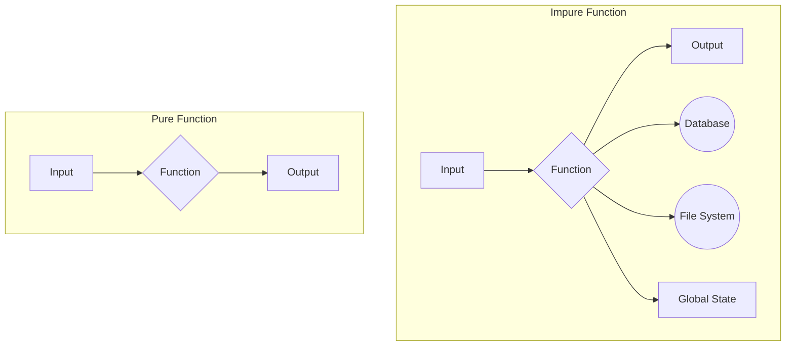

+++
title = "What is Functional Programming in Java?"
date = 2025-06-14
draft = false
tags = ["Java", "Functional Programming", "Software Development"]
+++

You've probably heard the term "functional programming" thrown around by some senior dev who talks about monads and referential transparency like it's the goddamn weather. You nod along, thinking, "Yeah, cool, streams and lambdas," but deep down, you're pretty sure it's just some academic circlejerk that has nothing to do with your day-to-day job of gluing together Spring Boot annotations.

You're not entirely wrong, but you're not right either.

Functional programming isn't a magic bullet. It's a paradigm, a way of thinking about and structuring your code. And believe it or not, Java—yes, verbose, enterprisey Java has been slowly bolting on functional features for years. Using them correctly can make your code cleaner, more predictable, and less prone to the kind of bugs that make you want to throw your laptop out the window.

This post is your no-nonsense guide to understanding and actually _using_ functional programming in Java. No ivory tower bullshit, just practical concepts with code you can actually use.

## The Core Dogma: What You Need to Believe

To get on board with the functional cult, you need to accept a few core tenets. They might seem weird at first, but they're the foundation for everything else.

### 1. Immutability: Stop Changing Shit

The first and most important rule of functional club is: you do not change state. An object is created, it lives its life, and it dies without ever changing its internal values.

"But how do you do anything?" you ask. Simple. Instead of changing an object, you create a _new_ one with the updated values.

Think of it like this: in traditional imperative code, an object is like a whiteboard. You can write on it, erase it, and write something new. It's flexible but also easy to make a mess. In functional programming, an object is like a stone tablet. Once you've carved something into it, it's there forever. If you need a different message, you grab a new stone tablet.

#### The "Old Way" (Mutable)

Here's a typical mutable Java object. Look at this piece of shit. Its state can be changed by anyone, at any time.

```java
public class MutableUser {
    private String name;
    private int age;

    public MutableUser(String name, int age) {
        this.name = name;
        this.age = age;
    }

    public void setName(String name) {
        this.name = name; // Side effect! The object is changed.
    }

    public void setAge(int age) {
        this.age = age; // Another side effect.
    }

    // Getters...
}
```

This looks fine until you pass this object to three different methods, and one of them changes the name without you realizing it. Now you've got a bug that'll take you three hours and seven redbulls to find.

#### The "Functional Way" (Immutable)

Now, let's make it immutable. Notice the `final` keywords and the lack of setters.

```java
public final class ImmutableUser {
    private final String name;
    private final int age;

    public ImmutableUser(String name, int age) {
        this.name = name;
        this.age = age;
    }

    public ImmutableUser withName(String newName) {
        return new ImmutableUser(newName, this.age); // Returns a new instance
    }

    public ImmutableUser withAge(int newAge) {
        return new ImmutableUser(this.name, newAge); // Returns a new instance
    }

    // Getters...
}
```

If you want to "change" the name, you call `withName()`, which gives you a brand-new `ImmutableUser` object. The original is untouched. This is predictable. It's safe. It's a hell of a lot easier to reason about, especially in multi-threaded environments.

### 2. Pure Functions: No Side Effects, No Surprises

A pure function is a function that, for a given input, will _always_ return the same output and has no observable side effects.

What the hell is a "side effect"? A side effect is anything a function does besides computing and returning a value. This includes:

- Modifying a global variable or a field on an object.
- Writing to a file, database, or the console.
- Calling another function that has side effects.

#### Impure Function: A Lying, Cheating Bastard

```java
private int value = 5;

public int add(int x) {
    this.value += x; // Side effect: modifies a field
    return this.value;
}
```

Call `add(5)` once, you get `10`. Call it again, you get `15`. Same input, different output. This function is impure and cannot be trusted.

#### Pure Function: Honest and Reliable

```java
public int add(int x, int y) {
    return x + y; // No side effects
}
```

Call `add(5, 5)` and you'll get `10`. Every. Single. Time. It doesn't matter when you call it, where you call it, or what else is happening in the application. It just works.

This predictability is a superpower. You can cache (memoize) the results, run the functions in parallel, and test them in isolation without setting up a bunch of mock objects and a Rube Goldberg machine of state.

Here's a diagram to beat it into your head:



## Java's Functional Toolkit

Okay, theory's over. Let's look at the actual tools Java gives you to implement this stuff.

### Lambdas and Functional Interfaces

Before Java 8, if you wanted to pass behavior, you had to use an anonymous inner class. It was verbose and ugly as sin.

```java
// Pre-Java 8
new Thread(new Runnable() {
    @Override
    public void run() {
        System.out.println("Hello from the old world");
    }
}).start();
```

With lambdas, this becomes:

```java
// Java 8+
new Thread(() -> System.out.println("Hello from the new world")).start();
```

That `() -> ...` is a lambda expression. It's a concise way to represent an anonymous function. It can be used anywhere a "functional interface" is expected. A functional interface is just an interface with a single abstract method, like `Runnable`, `Callable`, or `Comparator`. Java even gives you a bunch of general-purpose ones in the `java.util.function` package (`Function<T, R>`, `Predicate<T>`, `Consumer<T>`, `Supplier<T>`).

### The Stream API: Functional Pipelines for Collections

This is where functional programming in Java really shines. The Stream API lets you process collections of data in a declarative way. Instead of writing loops to iterate over a list, you create a pipeline of operations.

Let's say you have a list of users and you want to get the names of all the adults, in uppercase, sorted alphabetically.

#### The Old, Imperative Way

```java
List<User> users = ...;
List<String> adultNames = new ArrayList<>();
for (User user : users) {
    if (user.getAge() >= 18) {
        adultNames.add(user.getName().toUpperCase());
    }
}
Collections.sort(adultNames);
```

This code sucks. It's verbose, has mutable state (`adultNames`), and mixes the _what_ with the _how_.

#### The Functional, Stream-Based Way

```java
List<String> adultNames = users.stream() // 1. Get a stream
    .filter(user -> user.getAge() >= 18)   // 2. Keep only adults
    .map(user -> user.getName().toUpperCase()) // 3. Transform to uppercase names
    .sorted()                             // 4. Sort them
    .collect(Collectors.toList());        // 5. Collect the results into a new list
```

This is so much better it's not even funny. It reads like a description of the problem. Each step in the pipeline is a small, focused, and often pure function. The best part? The original `users` list is completely untouched.

### `Optional`: The Cure for `NullPointerException`

`NullPointerException` is the billion-dollar mistake, and `Optional` is Java's attempt to fix it. Think of it as a box. That box might contain something, or it might be empty. Before you can use what's inside, you have to open the box. No more blindly assuming a value is there and getting a nasty `NullPointerException`.

#### The Old, Risky Way

```java
public User findUser(String id) {
    // might return null
}

User user = findUser("123");
System.out.println(user.getName()); // BOOM! NullPointerException if user is null
```

#### The `Optional` Way

```java
public Optional<User> findUser(String id) {
    // returns Optional.of(user) or Optional.empty()
}

findUser("123")
    .map(User::getName)
    .ifPresent(name -> System.out.println("User's name: " + name));

// Or provide a default value
String username = findUser("456")
    .map(User::getName)
    .orElse("Guest");
```

No more `if (user != null)`. You operate on the `Optional` itself, chaining calls in a fluent, functional style.

## So, Should You Go Full Functional?

Probably not. Java is still fundamentally an object-oriented language. Trying to write "pure" functional code in Java can feel like trying to fit a square peg in a round hole.

But you absolutely should be using these functional features.

- **Use immutability** wherever possible. Records make this a no-brainer.
- **Favor pure functions**. Isolate side effects to the "edges" of your application.
- **Embrace the Stream API**. Stop writing `for` loops to process collections. It's about time, for Christ's sake.
- **Use `Optional`** as return types for methods that might not find anything.

Functional programming isn't an all-or-nothing cult. It's a set of powerful tools. Learn them, use them wisely, and write better, more robust Java code. Now stop reading and go refactor something.

~ ⋖,^><
