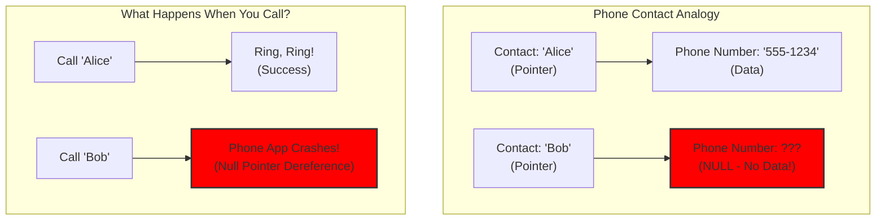
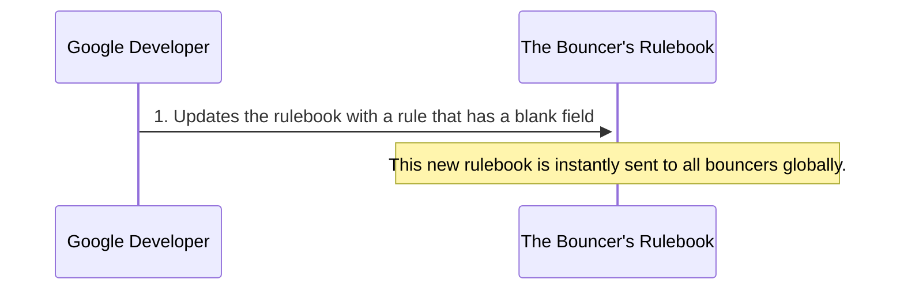
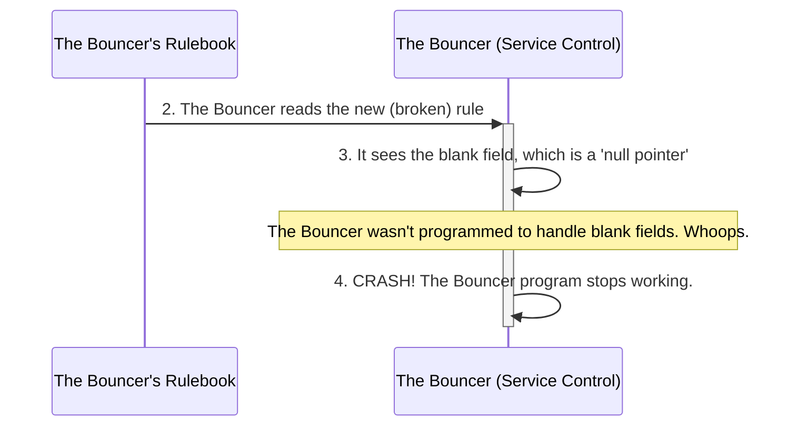
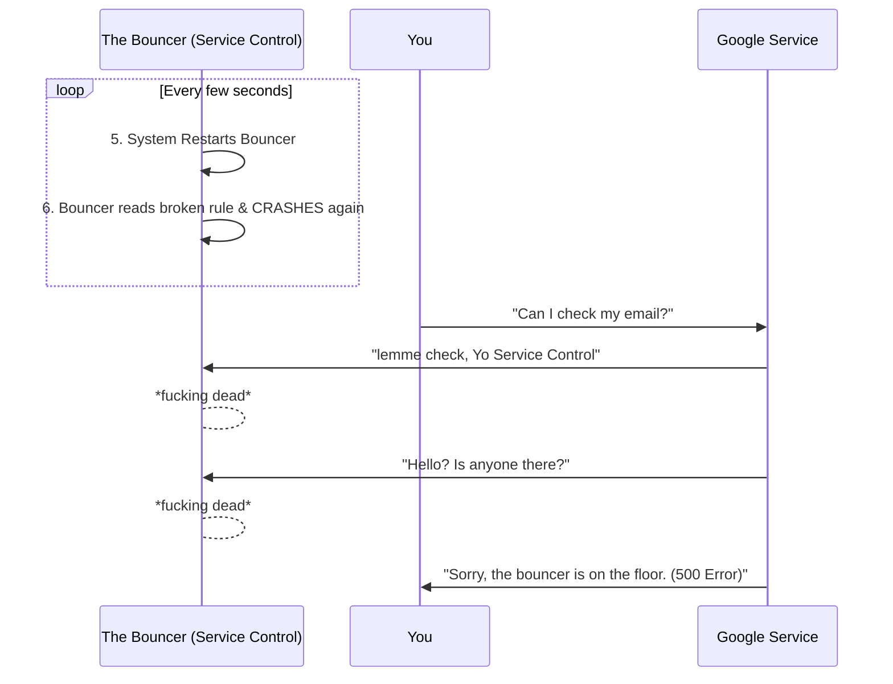
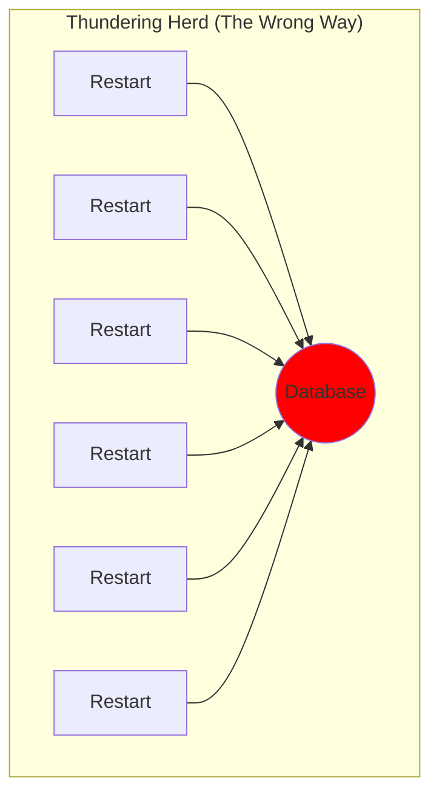
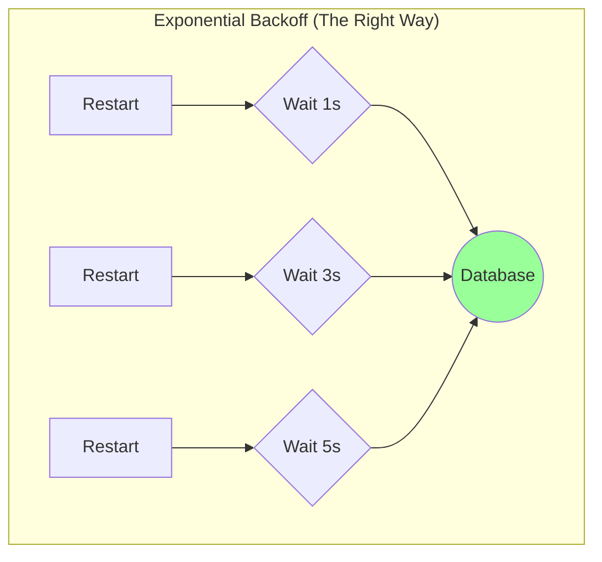

+++
title = "How a Single Bad Line of Code Took Down the Internet"
date = 2025-06-17
draft = false
tags = ["Ops"]
complexity = "medium"
+++

On Thursday, June 12th, the internet had a bit of a seizure. For about three hours, huge chunks of the web just... stopped working. Spotify, Google, AWS, Cloudflare—all the big players were flashing error messages. My own site went down, which I learned from my inbox being promptly flooded with about 100 "site down" alerts in 20 minutes. Not a great look.

Naturally, everyone's first thought was a cyberattack. But the reality was far more mundane, and frankly, a little hilarious. It wasn't a sophisticated state-sponsored hack. It was a classic, fundamental programming mistake that took down one of Google's core services.

They used a null pointer. A single, faulty line of code snowballed into a global outage.

### What the Hell is a Null Pointer?

If you're not a programmer, that term probably means nothing to you. Let's simplify it with an analogy.

Imagine your phone's contact list. Each contact has a name and a phone number. A **pointer** is like the contact's name—it "points" to the actual information, the phone number. When you tap the name, your phone knows which number to dial.

Now, imagine you save a contact with a name but **forget to add the phone number**. The name exists, but it points to nothing. This is a **null pointer**.

What happens when you try to call this contact? The phone app might freeze or crash because it was expecting a number and didn't get one. This crash is a **null pointer dereference**. It's one of the most common bugs in software development.

In Google's case, a critical service tried to use one of these "empty contacts" and crashed itself into oblivion.

### The Anatomy of a Global Outage

So how did this one tiny bug cause such a massive problem? It was a domino effect.

Google has a service called `Service Control`. Think of it as a digital bouncer for all their other services (like Gmail, YouTube, etc.). Before you can access a service, the bouncer checks your ID to make sure you have permission.

Here's the play-by-play of how the bouncer knocked itself out.

First, a developer updates the bouncer's rulebook with a new rule that, unfortunately, contains a blank field. This broken rule is instantly sent to all bouncers across the globe.

Next, the bouncer reads the new, broken rule. It sees the blank field, which the program interprets as a "null pointer," and it crashes because it wasn't designed to handle an empty field.

The system then tries to be helpful by restarting the bouncer. But the bouncer just reads the broken rule again and gets stuck in an infinite crash-and-restart loop. When you try to check your email, the bouncer is unavailable, and you get an error.

Because this rule was sent out globally, every `Service Control` bouncer across the planet started crashing in an endless loop.

### The Recovery Problem: A Thundering Herd

Credit where it's due, Google's engineers (SREs) were on this in minutes. They found the problem and hit the "red button". A kill switch to stop using the broken rule.

But this created a _new_ problem: the **thundering herd**.

Imagine a single store door on Black Friday. When the doors open, everyone tries to cram through at once, and nobody gets in. That's what happened here. All the crashed bouncers tried to restart at the _exact same time_. They all rushed to the central rulebook database, which became overloaded and couldn't serve anyone.

The proper way to handle this is with **exponential backoff**, which is like forming an orderly queue. Instead of everyone rushing at once, each bouncer waits a random amount of time before trying again, preventing a system-wide traffic jam.

Because the service lacked this "be polite" logic, it took nearly three hours for the largest regions to fully recover.

### The Big Picture

I love the cloud. But this incident highlights how fragile the modern internet has become. We've built a global economy on top of a few massive companies. The original internet was designed to be a decentralized network that could survive parts of it going down. Now, if one company has a bad day, the whole digital world feels it.

So what's the lesson here? That our gleaming, globally-connected world is a house of cards built on code written by tired people on a Tuesday?

Yes. That's exactly it.

This is the reality of modern software. It's complex, it's brittle, and it's run by humans who make mistakes. The biggest takeaway isn't that Google screwed up, but that the systems we've built are so interconnected that one tiny mistake can have a ripple effect that touches billions of people.

It's a sobering reminder that for all our talk of "resilience" and "redundancy," sometimes the whole system is just one `if (pointer != null)` away from a complete meltdown.

So the next time your favorite app goes down, don't just blame the company. Pour one out for the poor developer who probably just had the worst day of their life. You're still here? Go crochet a blanket or something. You might need the offline hobby for the next time this happens. Because trust me, it will happen again.
