+++
title = "I Automated My Homework and Left Class 2 Hours Early. You Can Too."
date = 2025-06-17
draft = false
tags = ["Java", "Functional Programming", "AI", "Productivity", "Cursor", "Poweruser"]
complexity = "easy"
+++

Last week, I walked out of my Functional Programming class a full two hours before anyone else.

While my classmates were sweating it out in a 26°C classroom trying to wrap their heads around what a `Consumer<T>` is, I was already home, probably in bed.

How?

Am I just better than everyone else? A programming god in mortal form?

...Okay, maybe. But the real reason is a bit more interesting. I have a system. A 'get-shit-done' workflow that basically does my homework for me. And it all kicked off because my teacher made a tiny mistake.

### The Accidental Goldmine

Three days before the lesson, my teacher accidentally pushed the PDF with the assignment to our class Teams channel. A notification popped up on my phone. Most people probably saw it, thought "cool, I'll ignore that for 72 hours," and went back to scrolling TikTok.

Not me. I saw an opportunity.

I immediately fed the PDF into my homework workflow.

### My "Get-Homework-Done" Machine

So what is this magical workflow? It's not a sentient robot butler (yet). It's simpler and, honestly, a lot more achievable for anyone reading this.

It's just **Cursor** armed with a set of predefined rules.

That's it. My 'secret' is an AI code editor that I've trained to understand exactly how my teacher likes his assignments. It knows the coding style, the documentation format, the project structure—everything.

Here's a step-by-step of what happens:

```mermaid
graph TD
    A["1. Download the PDF"] --> B["2. Turn it into a large PNG"];
    B --> C["3. Feed PNG into Cursor AI<br>with predefined rules"];

    subgraph "Parallel Outputs"
        direction LR
        D["Creates a new directory with<br>code, examples, and solutions"]
        E["Creates multiple Mermaid diagrams<br>explaining the work"]
    end

    C --> D;
    C --> E;

    D --> F["4. Review for logic/syntax errors<br>and understand the AI's output"];
    E --> F;

    F --> G["5. Push to repository"];
    G --> H["🎉 6. Submit the repo link 🎉"];
```

The "predefined rules" aren't complicated. It's basically a master prompt in Cursor that says: *"Hey, here's a PDF. Rip it apart. Find the tasks. The code needs to look like *this*. The comments need to be formatted like *that*. The final output should be a clean, well-documented project. Go."*

### The "Are You Serious?" Moment

The lesson began with a classic moment of academic reassurance. I asked if the subject we were about to cover would be on the exam. The teacher just shook his head. "No," he said, "this stuff is old anyways."

That was all the confirmation I needed. My automation pipeline wasn't just a time-saver; it was a filter for irrelevant work.

As he started explaining the very concepts my AI had already mastered for me, I patiently waited for him to finish his sentence, then my hand went up. I told him I'd already finished the assignment and asked if I could head home since I had other things to do.

He gave me that classic "is this kid for real?" look. After a moment of stunned silence, he asked if I was serious. I told him that I had submitted the assignment and sent him the link to the repository.

You could see his expression shift from disbelief to grudging acceptance as he scrolled through the perfectly formatted code and diagrams my workflow had generated. He muttered that it looked good and admitted that if everything was done, there was nothing left for me to do. He told me I could go.

I was a bit surprised, asking if he was sure, just to lock it in. He just sighed, confirmed I was marked as present, and waved me off.

And just like that, I was out.

### Stop Wasting Your Time. Build a Machine.

Look, the point of this story isn't to brag about skipping class (okay, it's a little bit about that). The point is that you're probably wasting a massive amount of time on repetitive, brain-dead tasks that a machine could do better and faster.

Every homework assignment, every project, every ticket at your job—they all have patterns. Your teacher, your boss, your client. They have specific expectations.

**Find the pattern. Automate the bullshit.**

You have the tools. You have AI assistants like Cursor. You have scripting languages. You have automation platforms. Stop manually setting up your project folders. Stop writing the same five boilerplate files every damn time. Stop doing things the "hard way" because you think it makes you a better developer. It doesn't. It makes you a slower one.

You're still here? Go find a repetitive task you have to do this week and figure out how to automate it. Your future self will thank you.
