+++
title = "Model Context Protocol: The One Remote to Rule Them All"
date = 2025-06-18
draft = false
tags = ["MCP", "AI", "Standards", "Architecture"]
complexity = "medium"
+++

Stop wiring a thousand custom webhooks. It's 2025, we have standards now. Enter **Model Context Protocol (MCP).** The universal adapter that lets your AI talk to _anything_ without the integration hangover.

## The Disease: Integration Hell

You've been there. You have a shiny new LLM, maybe a slick new internal tool, and a simple goal: make them talk. Should be easy, right?

Wrong.

You're immediately plunged into a special kind of purgatory. Model A speaks REST with a weird dialect of OAuth. Tool B demands gRPC and expects protobufs. The legacy system in the corner only communicates via XML sent over a carrier pigeon. Before you know it, you're not building features, you're just a full-time translator writing glue code.

Multiply the number of models (M) by the number of tools (N), and you're staring at an **M × N** explosion of connectors. It's a geometric progression of pain that makes your tech debt look like a rounding error. Every arrow in this diagram represents a weekend you'll never get back.


This isn't just inefficient; it's fragile. Every custom connector is another point of failure, another piece of esoteric knowledge that only one person on your team understands.

## The Cure: One Protocol to Rule Them All

MCP throws that entire mess in the garbage. It's a dead-simple, JSON-over-HTTP specification that acts as a universal adapter. Instead of M×N connectors, you have M+N implementations that all speak the same language.

```mermaid
graph TD
  subgraph "🚀 Your New Life With MCP (You're Welcome)"
    subgraph "Your Models"
      direction LR
      M1(Claude 3.5)
      M2(GPT-5)
      M3(Llama 4)
    end

    subgraph "Your Tools & Data"
      direction LR
      T1(📄 File System)
      T2(🗄️ Database)
      T3(🛠️ Custom API)
    end

    MCP_Gateway((🤖 MCP Server))

    M1 & M2 & M3 -- "One simple JSON format" --> MCP_Gateway
    MCP_Gateway -- "Reads file" --> T1
    MCP_Gateway -- "Queries data" --> T2
    MCP_Gateway -- "Executes tool" --> T3
  end
```



Your models don't need to know how to talk to a database or a file system. They just need to know how to speak MCP. The MCP server handles the dirty work of translation. One gateway. Done. Now you can actually build things.


## Under the Hood: The Anatomy of a Request

Let's get into the guts. An MCP request is just a JSON object sent over HTTP. It's intentionally boring. Here's a request to fetch a customer's data:

```jsonc
// POST /v1/context
{
  "version": "1.0",
  "request_id": "req_a1b2c3d4e5f67890", // So you can find this in logs later
  "client": {
    "name": "support-chatbot-v2",
    "model": "gpt-5-turbo",
    "user_id": "usr_42"
  },
  "operations": [
    {
      "op": "get",
      "path": "crm/customers/42.json",
      "cache": true // Please cache this, server. Don't be a hero.
    }
  ]
}
```

Let's break it down:

- **`version`**: So you don't break production when the spec updates to 1.1. Pin your versions, people.
- **`request_id`**: For the love of God, use this. When things go wrong, a unique ID is your only friend for tracing a request through six microservices.
- **`client`**: Metadata. Useful for logging, rate limiting, and figuring out which bot is burning all your money.
- **`operations`**: An array, because batching is your friend. You can ask for a file, run a tool, and read a directory all in one network round-trip. `op: "get"` is for fetching context. `path` is the resource you need.

The response is just as beautifully bland:

```jsonc
{
  "status": 200,
  "payload": {
    "file": {
      "content": "ewogICJuYW1lIjogIkpvaG4gRG9lIgp9", // base64 encoded
      "path": "crm/customers/42.json",
      "content_type": "application/json"
    }
  },
  "cost_ms": 12, // How long the server took
  "served_by": "mcp-edge-sfo3"
}
```

Consistency is better than cleverness. Your parser will thank you.

### The Handshake: Sync vs. Async

Fetching data is usually fast. But what about running a tool that takes a while, like generating a report or sending an email? For that, MCP uses a two-step async flow.

```mermaid
sequenceDiagram
    participant App as 🧩 Your App
    participant Server as 🔌 MCP Server

    App->>Server: POST /v1/tool { "tool": "sendEmail", "args": {...} }
    Note right of Server: I got it, but it's not done yet.
    Server-->>App: 202 ACCEPTED { "status": "queued", "task_id": "task_123" }

    Note over App,Server: Some time later...

    App->>Server: GET /v1/task/task_123
    Server-->>App: 200 OK { "status": "succeeded", "result": {...} }
```



This prevents your AI from sitting there like an idiot waiting for a long-running process to finish. It fires off the request, gets a task ID, and can check back later for the results.


## Authentication & Security (Because People are Terrible)

An open gateway is a welcome mat for hackers. Don't be that person. MCP doesn't dictate one true way to do auth, but here are the sane options:

1.  **Bearer Tokens:** The simplest method that works. Your client sends an `Authorization: Bearer <your-token>` header. The server validates it. It's simple, stateless, and good enough for most use cases. Just make sure you scope the tokens properly. A token for a documentation-reader bot shouldn't have permission to run `tool: "delete_database"`.
2.  **Signed URLs:** These are perfect for giving temporary, one-time access to a resource. The server can generate a URL with a cryptographic signature that grants access for a limited time. This is great for letting a model access a specific file without handing over a permanent key to the castle.
3.  **mTLS:** When you need to be absolutely sure that both the client and server are who they say they are. It's complex to set up, but for high-security environments where compliance lawyers roam, it's the gold standard.

Pro tip: Scope tokens to _operations_, not users. Your future self will send you a fruit basket.


## Spin Up Your Own MCP Server in 60 Seconds

Seriously, it's this easy. The reference implementation gives you a head start.

```bash
# Get the starter kit
npm create mcp-server@latest my-awesome-mcp-server

# Move into your new project
cd my-awesome-mcp-server

# Fire it up
npm run dev -- --port 3000
```

Now, let's add a tool. Create a file `tools/sendEmail.ts`:

```ts
// tools/sendEmail.ts
export default async function sendEmail({
  to,
  subject,
}: {
  to: string;
  subject: string;
}) {
  // Don't actually do this. Use a real email service.
  // This is just to show how easy it is.
  console.log(`📧 Pretending to send an email to ${to} about ${subject}`);
  return { ok: true, messageId: `msg_${Date.now()}` };
}
```

The framework automatically discovers any tool you drop in the `tools` directory. Restart the server, and you can now call `"sendEmail"` from any MCP client. Welcome to the future.


## Best Practices (Tattoo These on Your Forearm)

- **Batch Your Operations:** Network latency is the silent killer of performance. If you need three files and one tool, don't make four separate HTTP requests. Bundle them into a single `operations` array. Your app will feel 4x faster.
- **Embrace Idempotency:** Assume networks will fail. A client might send the same request twice. Design your tools so that running them multiple times with the same input has the same effect as running them once. Use the `request_id` to help you de-duplicate.
- **Log Everything:** Emit structured logs with the `request_id`, `client.name`, and `operation` details. When your AI goes haywire and starts sending 1,000 emails a second, you'll be able to pinpoint the problem in minutes, not days.
- **Implement Back-Pressure:** Your server is not invincible. If it's getting overwhelmed, it's better to fail fast by returning a `429 Too Many Requests` error than to fall over and die. This allows clients to implement retry logic gracefully.


## What MCP Is NOT

Let's clear the air. MCP is not magic.

- It is **not** a database. It can sit _in front_ of a database, but it has no storage itself.
- It is **not** a message queue like RabbitMQ or Kafka. It's for synchronous or simple async request/response, not for complex event-driven architectures.
- It is **not** a replacement for gRPC or other high-performance RPC frameworks. It's designed for flexibility and simplicity, not raw sub-millisecond speed.

It's a standard. A simple, boring, predictable standard for how an AI gets context. That's its superpower.


## Go Build Something. Now.

You're still here? Seriously? You've seen the pain of the old way and the simplicity of the new. Every minute you spend writing custom glue code is a minute you could have spent building something that actually matters.

Clone an MCP server, wrap your tools, and delete half your integration code. Then tweet me how many lines you nuked. Go.

