+++
title = "Your AI is a Frankenstein's Monster"
date = 2025-06-16
draft = false
tags = ["AI"]
complexity = "medium"
+++

Most of the "multimodal" AI models you're hearing about are a complete hack. They're like Frankenstein's monster. A bunch of different parts stitched together, pretending to be a single, coherent being. They can handle text, sure. They can look at a picture, yeah. But do they _truly_ understand the connection between a picture of a cat and the word "cat"?

**No.**

The problem is something called **Late Fusion**.

## The Old, Busted Way: Late Fusion

Imagine you have two specialists. One is a dude who has only ever seen images his entire life but can't read a single word. The other is a guy who has read every book in existence but is blind. To get them to work together, you hire a third guy to act as a translator, desperately trying to get them on the same page.

That's Late Fusion.

AI labs take a powerful Vision model (the blind reader) and a separate Large Language Model (the illiterate image-seer) and then smash them together. They train them separately and then try to connect them at the end of the process.

Here's what that mess looks like:

```mermaid
graph TD;
    subgraph Vision Pipeline
        A[🖼️ Image Input] --> B(👁️ Vision Model);
    end

    subgraph Language Pipeline
        C[📝 Text Input] --> D(🗣️ Language Model);
    end

    B --> E{Fusion Layer};
    D --> E;
    E --> F[Output];

```

Why do this? Because it's "easy." They can reuse powerful, pre-trained models that are already good at one thing. It's a shortcut. A lazy, inefficient shortcut that results in a model that lacks a genuine, deep understanding between what it sees and what it reads. It's a kludge, and it's holding AI back.

## The New Hotness: Early Fusion

Now, what if instead of hiring two weirdly specialized dudes and a stressed-out translator, you just raised one kid to both see and read from birth? They'd naturally form connections between objects and words. That's **Early Fusion**.

This is the approach Meta's and Apple's research is proving to be the real deal. Instead of separate models, you have one unified architecture. You treat everything—images and words—as the same type of data (tokens) and feed it all into the same brain from day one.

It looks something like this:

```mermaid
graph TD;
    A[🖼️ Image Input] --> B(🧩 Image Tokenizer);
    C[📝 Text Input] --> D(🧩 Text Tokenizer);

    subgraph Unified Model
        B --> E(🧠 Unified Transformer);
        D --> E;
    end

    E --> F["Unified Output <br> (Text, Images, etc.)"];

```

This was tricky at first. The "signals" from images are way louder and more intense than text, and they were drowning everything else out, making the model unstable. But after some smart normalization (basically, telling the image signals to chill out a bit), it worked beautifully.

And the results are insane.

1.  **It's More Efficient:** Turns out, stitching two models together has a ton of overhead. The unified Early Fusion models train faster, use less memory, and are easier to deploy. The lazy shortcut was actually the long, dumb route all along.
2.  **It's Smarter:** These models can do things Late Fusion models can only dream of, like generating a document with images and text interleaved naturally because the model actually _understands_ the flow.
3.  **It Learns on Its Own:** When they combined this with a Mixture of Experts (MoE)—which is like giving the model a team of specialized sub-brains—something amazing happened. The model _spontaneously_ assigned some experts to become vision specialists and others to become text specialists. No human guidance needed. It just self-organized in the most logical way. It's a match made in AI heaven.

## So, What's Next?

The evidence is piling up. Late Fusion is a dead end. The future is **native, multimodal models built with Early Fusion and a Mixture of Experts**. The models that are built from the ground up to be truly multimodal are going to blow the stitched-together Frankenstein models out of the water.

Companies like Meta and Apple are already way ahead. It's only a matter of time before everyone else stops wasting their time with the old way and jumps on the bandwagon. Stop building monsters and start building real intelligence.
