+++
title = "Netflix's Chaos Monkey: Let's Break Things on Purpose"
date = 2025-06-17
draft = false
tags = ["Ops"]
complexity = "medium"
+++

Imagine your website is a massive, complex castle. You've got walls, towers, and soldiers everywhere. You _think_ it's impenetrable. But what if one of your own guards, every single day, randomly knocked out a support beam just to see if the wall still stands?

That's basically what Netflix does with its software. The guard is a program called **Chaos Monkey**.

And its entire job is to break things **on purpose** to find weaknesses before your enemies do. It's a wild idea, but it's why Netflix stays online when so many others fall over.

## So, What the Hell is Chaos Monkey, Really?

Think of it like a fire drill. A real fire is a disaster. But a fire drill is a planned, controlled test to make sure that when the real fire happens, everyone knows what to do, the alarms work, and the escape routes are clear.

Chaos Monkey is the fire drill for your servers.

It's a tool that Netflix created to intentionally and randomly shut down parts of their own live system. The one you're using to binge-watch that new series. It picks a random server and poof, it's gone.

The goal is to answer one question, over and over: "Did anyone notice?"

If the answer is "no," it means the system is resilient. Other servers picked up the slack, and the show went on without a hiccup. If the answer is "yes," an alarm goes off—not for the outage, but for the engineering team, who now has a weakness to fix.

This whole practice is called **Chaos Engineering**.

## The Philosophy: Don't Wait for an Earthquake, Build on a Shake Table

Most companies live in fear of failure. They react.

```mermaid
graph TD
    subgraph "The Cycle of Panic"
        A[🔥 Surprise! An Outage Happens] --> B{🚨 Alarms Go Off};
        B --> C[😡 Customers Are Mad];
        C --> D[🧑‍💻 Everyone Drops Everything to Fix It];
        D --> E[🩹 A Hasty Patch is Applied];
        E --> F[🙏 We Hope It Never Happens Again];
        F -.-> A;
    end
```

Chaos Engineering argues that hope is not a strategy. Failure is inevitable. So instead of waiting for it, you trigger it yourself, on your own terms. You become proactive.

It's like being a boxer. You don't prepare for a championship fight by avoiding punches. You prepare by sparring, getting hit in a controlled environment so you learn how to take a punch.

## How the Monkey Works: A Drill Sergeant's Inspection

Chaos Monkey isn't just smashing things randomly. It's methodical and sophisticated. Think of it like a drill sergeant making a surprise inspection of the barracks.

1.  **The Roster (Configuration):** The sergeant is given a list of barracks to inspect. You tell Chaos Monkey which applications are in-bounds for testing and, crucially, when. (e.g., only during business hours, when your engineers are on deck).
2.  **The Inspection (Scanning):** The sergeant walks the grounds to see which barracks are on the list. Chaos Monkey scans the system (using a tool like [Spinnaker](https://spinnaker.io/)) to find all the live servers for those applications.
3.  **The Point (Selection):** The sergeant randomly points at a soldier and says, "You! Drop and give me twenty!" Chaos Monkey randomly selects one server from the group.
4.  **The Test (Termination):** The soldier has to perform. Chaos Monkey makes a call to the cloud provider (like AWS) and terminates that server instance. Instantly.

The system is expected to carry on without that "soldier." If it can't, the drill sergeant knows there's a weak link in the unit.

## Isn't This Just... Dangerous?

Yes and no. It's like playing with fire, but you're wearing a fireproof suit and holding an extinguisher. Chaos Engineering has rules:

- **Start Small:** You don't start by shutting down your payment processing database. You start with a low-risk, internal-only application.
- **Minimize the Blast Radius:** The first experiments are tiny. You ensure that if something goes wrong, it affects the smallest number of users possible. As confidence grows, the "blast radius" can expand.
- **Run it During Work Hours:** You run these tests when engineers are on the clock and ready to fix things, not at 3 AM on a Saturday.

## The Simian Army: Chaos Monkey's Friends

Netflix didn't stop with Chaos Monkey. They built a whole suite of tools they call the **Simian Army** to cause different kinds of trouble:

- **Latency Monkey:** Injects delays to simulate slow network connections.
- **Doctor Monkey:** Finds unhealthy instances and removes them from service (like a real doctor).
- **Janitor Monkey:** Finds and removes unused resources to clean up the environment and save money.

It's a whole ecosystem built around the idea of proactive, aggressive self-testing.

## And Then There's Chaos Kong

If Chaos Monkey is a drill sergeant testing one soldier, Chaos Kong is the ultimate test: taking the entire military base offline.

Chaos Kong is the next level of chaos engineering. It doesn't just terminate a single server; it simulates the failure of an entire AWS region.

Think about that. Netflix got so good at surviving the failure of individual servers that they started practicing for the failure of entire geographic areas. They built their systems to be so resilient that they can migrate all of their traffic from one region (say, US-East) to another (like US-West) automatically, with no noticeable impact on the user.

This is the holy grail of resiliency. It's how you survive massive, widespread outages that would take down lesser companies for hours or even days. It's the ultimate expression of the chaos philosophy: don't just prepare for a server to die, prepare for a whole chunk of the internet to vanish.

## The Payoff & Your First Step

The benefits are huge. You build a system that is genuinely tough, not just "looks good on paper." You force developers to think about failure from day one.

So how do you start? You don't need to download Netflix's code today. The mindset is what counts.

1.  **Have the "What-If" Conversation:** Get your team in a room and ask: "What happens if our main database goes offline for 5 minutes?" Don't just assume. Whiteboard it.
2.  **Run a Manual Drill:** Go to your staging environment (NOT production!) and manually unplug something. Pull the virtual network cable on a web server. Shut down a replica database. Watch what happens. Did it match your whiteboard?
3.  **Embrace the Red:** When you find a weakness, celebrate it. You found a bomb before it exploded. That's a huge win.

Stop waiting for the next fire. Light a match, and see how well your system handles the heat. That's the way of the Chaos Monkey.

## References

- [Netflix Chaos Monkey](https://netflix.github.io/chaosmonkey/)
- [Chaos Engineering](https://principlesofchaos.org/)
- [Spinnaker](https://spinnaker.io/)
