+++
title = "Notepad Can Run Code Now. No, Not Like That."
date = 2026-02-11
draft = false
tags = ["Security", "Ops"]
complexity = "easy"
description = "Microsoft added Markdown to Notepad and accidentally shipped an 8.8 CVSS remote code execution vulnerability. Here's how CVE-2026-20841 works."
+++

Remember when Notepad was just... Notepad?

A simple, lightweight, no-nonsense text editor. The one app on your Windows machine that you _knew_ couldn't hurt you. No macros. No scripting engine. No plugins. Just plain text on a screen.

Well. Microsoft decided to change that.

And now Notepad can execute arbitrary code on your machine.

Let that sink in.

## A Quick History Lesson

In 2024, Microsoft killed WordPad. Gone. Removed from Windows 11 24H2.[^wordpad]

A lot of people asked: _"Where do I go for basic formatting now?"_

Microsoft's answer? **Notepad.**

In May 2025, they started rolling out Markdown support to Notepad. Bold text, italic, headings, hyperlinks — the works. A formatting toolbar. A toggle between rendered Markdown and raw syntax view.[^insiders]

Some people loved it. Many people hated it. The critics said Notepad was losing its soul. It was supposed to be simple. Fast. Invisible. Now it was becoming a mini-WordPad.

Then in September 2025, they added AI writing features. Because of course they did.

But here's the thing nobody saw coming: that shiny new Markdown renderer? It shipped with a **command injection vulnerability**.

An 8.8 CVSS score. That's not a typo.

## CVE-2026-20841: The Vulnerability

Let's talk about what actually happened.

The vulnerability is tracked as **CVE-2026-20841**, classified under **CWE-77: Improper Neutralization of Special Elements used in a Command**.[^nvd]

In plain English: when Notepad renders a Markdown file, it processes hyperlinks. Those links can point to URLs. But they can _also_ point to protocol handlers — custom URI schemes that tell Windows to launch specific applications.

The problem? Notepad didn't validate which protocols were safe.

An attacker could craft a Markdown file with a link that, when clicked, triggers an **unverified protocol handler**. That handler loads and executes files with the current user's permissions.[^register]

No admin rights needed. No privilege escalation required. Just click a link in a text file.

```mermaid
sequenceDiagram
    participant Attacker
    participant Victim as Victim (User)
    participant Notepad as Windows Notepad
    participant OS as Windows OS

    Attacker->>Victim: Sends crafted .md file (email, share, etc.)
    Victim->>Notepad: Opens file in Notepad
    Note over Notepad: Markdown renderer processes file
    Notepad->>Victim: Displays formatted content with clickable link
    Victim->>Notepad: Clicks the link
    Notepad->>OS: Invokes unverified protocol handler
    OS->>OS: Executes attacker-controlled payload
    Note over OS: 💀 Code runs with user's full permissions
```

That's it. That's the whole attack chain. Open file. Click link. Game over.

## The CVSS Breakdown

Let's look at why this scored an **8.8 out of 10**:

| Metric                 | Value        | What it means                                      |
| ---------------------- | ------------ | -------------------------------------------------- |
| Attack Vector          | **Network**  | Can be delivered remotely (email, web, file share) |
| Attack Complexity      | **Low**      | No special conditions needed                       |
| Privileges Required    | **None**     | Attacker needs zero access to your system          |
| User Interaction       | **Required** | You have to open the file and click the link       |
| Confidentiality Impact | **High**     | Your files, your data, all readable                |
| Integrity Impact       | **High**     | Attacker can modify anything you can               |
| Availability Impact    | **High**     | They can trash your system                         |

The only thing keeping this from a 9+ is that single "User Interaction: Required." You have to click. That's the entire safety net.[^redpacket]

## Why This Is Worse Than It Sounds

_"But it requires user interaction! People won't just click random links!"_

Right. Because phishing never works. Nobody ever clicks suspicious links.

Oh wait. Phishing is literally the number one initial access vector for cyberattacks. It has been for years. People click things. That's what people do.

And consider the context: this is **Notepad**. The app everyone trusts. The app that's been harmless for over 30 years. If someone sends you a `.md` file and says "hey, check out these notes," you're going to open it. And when you see a nicely rendered Markdown document with a helpful-looking link... yeah. You're going to click it.

```mermaid
graph TD
    A["Attacker crafts malicious .md file"] --> B["Delivers via email / Teams / file share"]
    B --> C{"User opens in Notepad?"}
    C -->|"Most users: Yes, it's just Notepad"| D["Markdown renders with malicious link"]
    C -->|"Paranoid users: Opens in vim"| E["Safe ✓"]
    D --> F{"User clicks link?"}
    F -->|"Yes"| G["Command injection executes"]
    F -->|"No"| H["Safe ✓"]
    G --> I["Arbitrary code execution"]
    I --> J["Data exfiltration"]
    I --> K["Malware installation"]
    I --> L["Lateral movement"]

    style G fill:#ff4444,color:#fff
    style I fill:#ff4444,color:#fff
    style E fill:#44aa44,color:#fff
    style H fill:#44aa44,color:#fff
```

## The Bigger Pattern: Text Editors Under Siege

Here's something wild. Just nine days ago, I wrote about how [**Notepad++ was hijacked by state-sponsored hackers**](/blog/notepad-plus-plus-hijack/) through a compromised update mechanism. A Chinese APT group called Lotus Blossom infiltrated the hosting infrastructure and served malicious updates to targeted users for **six months**.

Now Windows Notepad has its own RCE.

Two text editors. Two completely different attack vectors. Same result: your "harmless" text editor becomes a weapon.

It's almost poetic. The open-source community's beloved text editor got hit through its supply chain. Microsoft's built-in text editor got hit through a feature nobody asked for.

Different roads, same destination.

## What's Affected

This vulnerability affects **Windows Notepad versions 11.0.0 through 11.2509**.[^redpacket]

If you're running Windows 11 and you haven't specifically disabled Markdown support in Notepad's settings, you're running a vulnerable version right now.

The good news: Microsoft patched it in the **February 2026 Patch Tuesday** update on February 10, 2026. The fix is Notepad version **11.2510**.[^bleeping]

The bad news: this Patch Tuesday was a beast. 58 total flaws. **Six actively exploited zero-days.** Three publicly disclosed. This Notepad bug is just one of twelve remote code execution vulnerabilities patched.[^bleeping]

```mermaid
pie title February 2026 Patch Tuesday — 58 Flaws
    "Elevation of Privilege" : 25
    "Remote Code Execution" : 12
    "Spoofing" : 7
    "Information Disclosure" : 6
    "Security Feature Bypass" : 5
    "Denial of Service" : 3
```

Twelve RCEs in one month. Just let that number sit with you for a second.

## Detection: What To Watch For

If you're a sysadmin or you run a SOC, here's what to look for:

- **Notepad.exe spawning cmd.exe or PowerShell** — this should never happen under normal circumstances
- **Notepad.exe making outbound network connections** — plain text editors don't phone home
- **Unusual process chains** originating from Notepad after a user opens a `.md` file
- **Encoded payloads or suspicious arguments** in processes spawned by Notepad

```mermaid
graph LR
    subgraph "🔴 Suspicious Process Chain"
        A["notepad.exe"] -->|spawns| B["cmd.exe"]
        B -->|executes| C["powershell.exe -enc ..."]
        C -->|downloads| D["malicious payload"]
        C --> |connects to| E["random oblivious IP address"]
    end

    subgraph "🟢 Normal Notepad Behavior"
        F["notepad.exe"] -->|reads/writes| G["text files"]
        G -->|no child processes| H["that's it"]
    end
```

If Notepad is spawning shell processes, something is very, very wrong.

## What You Should Do Right Now

### 1. Update Windows Immediately

Apply the February 2026 Patch Tuesday update. This patches Notepad to version 11.2510, which fixes CVE-2026-20841 along with 57 other vulnerabilities.[^bleeping]

### 2. Disable Markdown Rendering (If You Don't Need It)

Open Notepad → Settings → Turn off text formatting / Markdown support. If you don't need fancy rendered text in your text editor (and let's be honest, did you ever?), turn it off. Reduce your attack surface.

### 3. Don't Open Random .md Files

Treat `.md` files from unknown sources the same way you'd treat `.exe` files. Just because it's "just a text file" doesn't mean it's safe anymore. We're past that.

### 4. Monitor for Anomalous Notepad Behavior

If you're running an EDR solution, create a rule to flag Notepad spawning child processes. That's not normal. That's never normal.

| Action                                               | Priority    | Effort    |
| ---------------------------------------------------- | ----------- | --------- |
| Apply February 2026 Patch Tuesday updates            | 🔴 Critical | 10 min    |
| Disable Markdown rendering in Notepad settings       | 🟠 High     | 2 min     |
| Add detection rules for Notepad spawning shells      | 🟠 High     | 30 min    |
| Audit recent `.md` file activity in your environment | 🟡 Medium   | 1-2 hours |
| Review and restrict protocol handler registrations   | 🟡 Medium   | 2-4 hours |

## The Irony Is Not Lost

Microsoft killed WordPad because it was too bloated. They added WordPad's features to Notepad. And in doing so, they introduced the kind of vulnerability that WordPad never had.

The people who said "just leave Notepad alone" are having the smuggest day of their lives right now. And honestly? They earned it.

A text editor that can execute arbitrary code isn't a text editor anymore. It's an attack surface with a blinking cursor.

No known exploitation in the wild yet. But there's a proof-of-concept on GitHub already.[^feedly] The clock is ticking.

Patch your systems. Disable what you don't need. And maybe, just maybe, stop adding features to things that were perfect the way they were.

[^wordpad]: PCWorld - _WordPad is dead in Windows 11, but Notepad is absorbing its skills_ (2024) [https://www.pcworld.com/article/2799269/wordpad-is-dead-in-windows-11-but-notepad-is-absorbing-its-skills.html](https://www.pcworld.com/article/2799269/wordpad-is-dead-in-windows-11-but-notepad-is-absorbing-its-skills.html)
[^insiders]: Windows Insider Blog - _Text Formatting in Notepad begin rolling out to Windows Insiders_ (May 30, 2025) [https://blogs.windows.com/windows-insider/2025/05/30/text-formatting-in-notepad-begin-rolling-out-to-windows-insiders](https://blogs.windows.com/windows-insider/2025/05/30/text-formatting-in-notepad-begin-rolling-out-to-windows-insiders)
[^nvd]: NVD - _CVE-2026-20841_ [https://nvd.nist.gov/vuln/detail/CVE-2026-20841](https://nvd.nist.gov/vuln/detail/CVE-2026-20841)
[^register]: The Register - _Notepad's new Markdown powers served with a side of RCE_ (Feb 11, 2026) [https://www.theregister.com/2026/02/11/notepad_rce_flaw/](https://www.theregister.com/2026/02/11/notepad_rce_flaw/)
[^redpacket]: RedPacket Security - _CVE Alert: CVE-2026-20841_ [https://www.redpacketsecurity.com/cve-alert-cve-2026-20841-microsoft-windows-notepad/](https://www.redpacketsecurity.com/cve-alert-cve-2026-20841-microsoft-windows-notepad/)
[^bleeping]: BleepingComputer - _Microsoft February 2026 Patch Tuesday fixes 6 zero-days, 58 flaws_ (Feb 10, 2026) [https://www.bleepingcomputer.com/news/microsoft/microsoft-february-2026-patch-tuesday-fixes-6-zero-days-58-flaws](https://www.bleepingcomputer.com/news/microsoft/microsoft-february-2026-patch-tuesday-fixes-6-zero-days-58-flaws)
[^feedly]: Feedly CVE Tracker - _CVE-2026-20841 Proof of Concept_ [https://feedly.com/cve/CVE-2026-20841](https://feedly.com/cve/CVE-2026-20841)
