+++
title = "Notepad++ Got Hijacked by State Hackers. Your Text Editor."
date = 2026-02-02
draft = false
tags = ["Security", "Ops"]
complexity = "medium"
description = "State-sponsored hackers compromised Notepad++ updates for 6 months. Here's exactly how they did it and what you need to do."
+++

Let that sink in for a second. `Notepad++`, the `open-source text editor` that's been on every Windows dev's machine since 2003, was `silently hijacked` for six months. 

They weren't after military secrets or nuclear codes. They targeted the update mechanism of a **text editor**.

If you've been running Notepad++ and clicked "yes" on an update prompt between June and December 2025, you might want to sit down for this one.

## What Actually Happened?

This wasn't some clever exploit in Notepad++'s code. The software itself was fine. The attackers went deeper: they compromised the **hosting provider's infrastructure**[^status]. They didn't break down the front door, they bribed the building's foundation.

Here's the timeline:

The attackers didn't just randomly break in. They specifically hunted for the `notepad-plus-plus.org` domain in the compromised server. They knew exactly what they were looking for.[^status]

## The Attack Vector: Exploiting Trust

What made this attack effective is how it exploited the trust between you and your software.

When Notepad++ checks for updates, it pings a PHP endpoint: `notepad-plus-plus.org/update/getDownloadUrl.php`. Normally, this returns the URL of the legitimate installer. The attackers intercepted this traffic and served up their own malicious download links instead.

The problem? The old versions of Notepad++ didn't verify the certificate or signature of the downloaded installer. The update mechanism just trusted whatever it was told.

## Why a Text Editor? Seriously?

You might be wondering: why would a state-sponsored group waste resources on a text editor?

**Because developers use it.** And developers have access to:

- Source code repositories
- Production servers
- API keys and credentials
- Internal documentation
- CI/CD pipelines

Compromising a developer's machine is the first step to compromising everything they touch. It's called a **supply chain attack**, and it works.

This is why nation-states don't always go after the flashy targets. Sometimes the backdoor into a Fortune 500 company is through some dev's favorite text editor.

## The Selective Targeting: Not Everyone Got Pwned

Here's where it gets even more sophisticated. The attackers didn't just spray malware at everyone. They were **selective**.

According to the hosting provider's analysis:

> "The bad actors specifically searched for https://notepad-plus-plus.org/ domain with the goal to intercept the traffic to your website, as they might know the then-existing Notepad++ vulnerabilities related to insufficient update verification controls."

Translation: They knew exactly what they were doing. They likely had a list of high-value targets—specific IP addresses or organizations—and only served malicious updates to *those* users. Everyone else got the clean version.

This selective targeting is typical of well-resourced threat actors. It keeps the operation quiet longer and focuses resources on valuable targets.

## The Fix

After the disclosure, Notepad++ developer Don Ho took several steps:

1. **Migrated to a new hosting provider** with better security practices
2. **Enhanced WinGup (the updater)** in v8.8.9 to verify both certificate and signature of downloaded installers
3. **Signed the XML update manifest** using XMLDSig
4. **Full enforcement of signature verification** coming in v8.9.2

The update server's response is now cryptographically signed. Even if an attacker redirects traffic, they can't forge a valid signature without the private key.

```mermaid
graph TD
    subgraph "New Secure Update Flow"
        A[Your Notepad++] -->|"Any updates?"| B[Update Server]
        B -->|"Signed XML Manifest"| A
        A -->|"Verify Signature ✓"| A
        A -->|"Download Installer"| C[Installer File]
        C -->|"Verify Certificate ✓"| A
        C -->|"Verify Signature ✓"| A
        A -->|"All checks pass"| D[Safe to Install]
    end

    subgraph "Attacker Attempt"
        E[Attacker] -->|"Fake Manifest"| F{Signature Check}
        F -->|"INVALID ✗"| G[Rejected]
    end

```

## What Should You Do Right Now?

If you've used Notepad++ at all in 2025, here's your action plan:

### 1. Update Immediately
Download [v8.9.1](https://notepad-plus-plus.org/downloads/v8.9.1/) manually from the official website. Don't use the built-in updater on old versions—that's the exact mechanism that was compromised.

### 2. Scan Your Machine
Run a full antivirus scan (with Microsoft Defender). Don't go install another anti-virus from a sketchy website that serves you `WebCompanion` straight out of the oven, you'll need an anti-anti-virus...

### 3. Rotate Your Credentials
If you're a developer and you used Notepad++ during the compromise window (June-December 2025):
- Rotate your SSH keys
- Rotate your API tokens
- Change passwords for any services you accessed from that machine

### 4. Check Your Logs
Look for unusual activity in your git history, CI/CD pipelines, and server access logs during the compromise period.

## The Bigger Picture

If Notepad++, a 20-year-old, widely-trusted tool, can be compromised at the infrastructure level, so can anything else.

The lessons here:

- **Code signing is not optional.** If your update mechanism doesn't cryptographically verify downloads, you're playing Russian roulette.
- **Your hosting provider is a single point of failure.** Even if your code is perfect, a compromised server can inject malware.
- **Supply chain attacks are common now.** Sophisticated attackers aren't brute-forcing passwords; they're poisoning the tools you trust.

## What You Should Do

Most risks feel theoretical until you become part of the statistic.

Here's what you need to do today:

| Action | Priority | Effort |
|--------|----------|--------|
| Update Notepad++ to v8.9.1 manually | 🔴 Critical | 5 min |
| Run a full malware scan | 🔴 Critical | 30 min |
| Rotate credentials if you updated during June-Dec 2025 | 🟠 High | 1 hour |
| Review your update mechanisms for all software | 🟠 High | 2-4 hours |
| Audit your software supply chain | 🟡 Medium | Ongoing |

Don't assume you're safe because "you're not a target." The attackers were selective, but you don't know if you were on their list. It's always best to assume the worst and act accordingly, 
you must be proactive first, and still be prepared to react.

What are you still doing here? Your text editor can be a security risk. Go treat it accordingly.

[^status]: notepad-plus-plus.org - _Notepad hijacked incident info update_ (Feb 02, 2026) [https://notepad-plus-plus.org/news/hijacked-incident-info-update/](https://notepad-plus-plus.org/news/hijacked-incident-info-update/)
