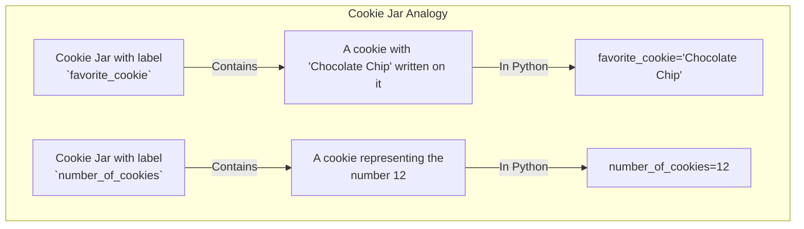
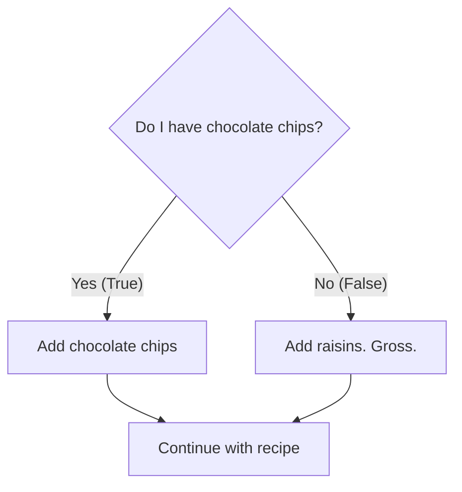
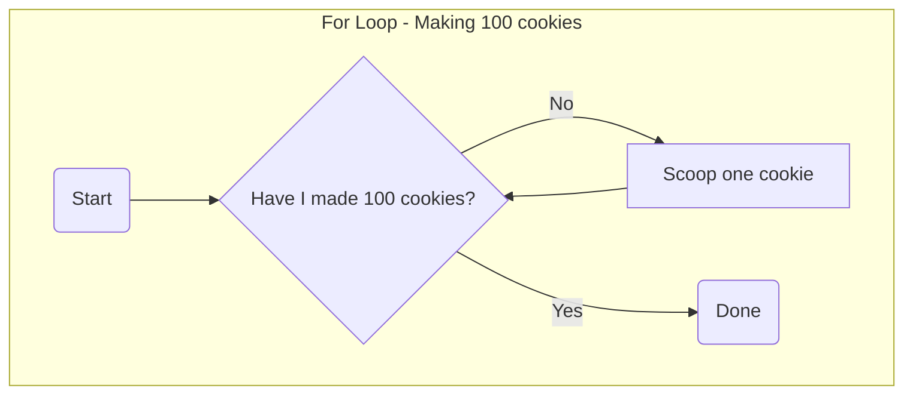
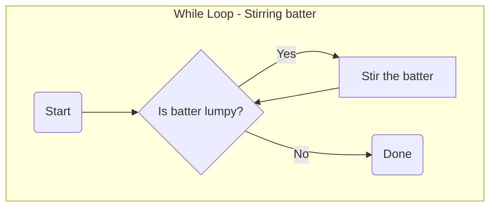

+++
title = "Programming 101"
date = 2025-06-18
draft = true
tags = ["Dev"]
complexity = "easy"
+++

I've got alot of friends that say stuff like:

> How do I learn to code?

Here, I will try to explain the basics of programming in a way that is easy to understand.

## Basic Concepts

| Concept              | Description                                                | Examples                                                          |
| -------------------- | ---------------------------------------------------------- | ----------------------------------------------------------------- |
| Hardware             | The physical components of a computer. Stuff you CAN touch | Keyboard, mouse, monitor, CPU, RAM, etc.                          |
| Software             | The programs and data that run on a computer.              | Word, Excel, Chrome, VSCode, etc.                                 |
| Data                 | Information that is stored.                                | Text, images, videos, etc.                                        |
| Programming Language | A language that tells a computer what to do.               | Python, Java, JavaScript, etc.                                    |
| Computer Program     | A set of instructions that tell a computer what to do.     | A program that opens a browser, a program that plays a game, etc. |
| Variables            | A way to store information in a computer program.          | `name = "John"`                                                   |

So to recap:

- The `Hardware` is the physical components of a computer. Stuff you CAN touch.
- The `Software` is the programs and data that run on a computer. Stuff you CANNOT touch.
- We tell the computer what to do using a `programming language`.
- The Computer Program is a set of instructions that tell a computer what to do.
- The Variables are a way to store information in a computer program.

## Example

Lets say you want to build the simplest possible program.
We will use `Python`, a programming language that is easy to learn.

```python
print("Hello, World!")
```

This code (the `print("Hello, World!")`) will print "Hello, World!" to the console.
lets see it in action:


Okay, but when I want to run it again, I have to write the code again?

No, bigot.

We **write it into a file**. just like you write your passwords into a `.txt` file (WHICH YOU SHOULD NOT DO, BY THE WAY), we just write our code into a `.py` file.
Thats called `file extension`.

File extensions are a way to tell the computer what kind of file it is and what to do with it.

Lets see it in action:
I've written the following code:

```python
# We can also add comments!
# If a line starts with "#", it won't be executed
# <-- just like this
print("Hello World!")
```

I've saved it as `example-hello-world.py`


Okay, but how do I run it?

We use a `terminal` to run the code.

A terminal is a program that allows you to interact with the computer.

## Variables, Explained With Cookies

Alright, let's talk about `variables`. The name sounds scary, but it's dead simple.

Think of a **variable** as a **cookie jar**.

That's it. A cookie jar on your kitchen counter. You can put stuff in it.
What kind of stuff? Cookies, obviously.

In programming, when we write this:

```python
favorite_cookie = "Chocolate Chip"
```

We're doing this:

1.  We grab a cookie jar (the variable).
2.  We slap a label on it called `favorite_cookie` (the variable name).
3.  We put a delicious chocolate chip cookie inside (the value).

The value can be anything. It can be text, like `"Chocolate Chip"`, or a number, like `12` (maybe for how many cookies are in the jar).

```python
number_of_cookies = 12
```

Now you have another cookie jar labeled `number_of_cookies` with the number 12 inside. You can check what's inside your jars anytime. If you "print" the variable, you're just looking inside the jar.

The cool part is you can **change** what's inside.

```python
# You have 12 cookies
number_of_cookies = 12
print(number_of_cookies) # This will show 12
number_of_cookies = number_of_cookies - 1
print(number_of_cookies) # This will now show 11
```

A variable is just a container for a piece of information that might change. Stop overthinking it.

Here's a diagram for your smooth brain:



### Different Kinds of Cookies (Data Types)

So, you have cookie jars. But not all cookies are the same, are they?

- **Text (String):** This is like a cookie with words written on it. In code, we wrap it in quotes. `"Hello, idiot"`.
  - ```python
    favorite_cookie = "Chocolate Chip"
    ```
- **Whole Numbers (Integer):** This is a plain number cookie. `1`, `42`, `-10`. No decimals.
  - ```python
    number_of_cookies = 12
    ```
- **Numbers with Decimals (Float):** This is a fancy cookie with a decimal point. `3.14`, `99.9`.
  - ```python
    pi = 3.14
    ```
- **True/False (Boolean):** This is a special two-sided cookie. One side says "Yes" (`True`), the other says "No" (`False`). It's for answering simple yes/no questions.
  - ```python
    is_hungry = True
    ```

Your computer needs to know what _kind_ of cookie it's dealing with. You don't try to do math with a text cookie. That's just stupid.

## Making Decisions (If/Else)

Let's say you're a baker. You follow a recipe. But sometimes, the recipe has choices.

> **If** you have chocolate chips, add them.
> **Otherwise**, just use raisins.

That's an `if/else` statement. It's how a program makes a decision. It checks a condition, and does one thing if it's true, and another thing if it's false.

Here's an example for you to understand:



Here's the code version:

```python
have_chocolate_chips = True # It's our Yes/No cookie!

if have_chocolate_chips == True: # It's a yes/no question.
    print("Adding chocolate chips. Yum.") # If true.
else:
    print("Ugh, raisins it is.") # If false.
```

Since our `have_chocolate_chips` jar has a "Yes" cookie inside (`True`), the program will print the first message. If it was `False`, it would print the second.

This is the entire basis for how programs seem "smart". They're just following a bunch of `if/else` recipes very, very fast.

## Doing Things Over and Over (Loops)

What if your recipe says "scoop 100 cookies"? Are you gonna write `scoop cookie` 100 times?

Fuck no. You're a programmer now, you're lazy and efficient. You use a **loop**.

A loop is for doing the same shit over and over again without rewriting the code.

### The "For" Loop

You use a `for` loop when you know _exactly_ how many times you need to do something.

```python
# This will run the code inside it 100 times.
cookies_amount = 100
for cookies in range(cookies_amount):
  print("Scooping a cookie...")

print("All done. That was easy.")
```

This code will print "Scooping a cookie..." 100 times. It's like telling your robot helper, "For every cookie in the jar, scoop it out."

Visuals for your viewing pleasure:



### The "While" Loop

You use a `while` loop when you need to repeat something _until a condition is met_.

For example: "Keep stirring the batter **while** it is still lumpy." You don't know how many stirs it will take, you just know you stop when it's smooth.

Keep in mind that the code is read from top to bottom, left to right.

```python
⬇️ batter_is_lumpy = True
⬇️ stirs = 0
⬇️
⬇️ while batter_is_lumpy == True:
⬇️    print("Stirring the batter...")
⬇️    stirs = stirs + 1 # add 1 to stirs
⬇️    if stirs > 5:  # Let's pretend it gets
⬇️                   # smooth after 5 stirs
⬇️        batter_is_lumpy = False
⬇️
⬇️ print("Batter is smooth now!")
⬇️
```

Visuals for your viewing pleasure:



This is how games work. **While** the player is alive, keep running the game loop. If the player's health hits zero, the loop stops.

Visuals for your viewing pleasure:


## Putting It All Together: A Simple "Game"

Let's combine everything. We'll make a tiny number guessing game. It's a rite of passage. Don't fuck it up.

Here's the recipe (the code):

1.  Pick a secret number.
2.  Ask the player to guess.
3.  **If** the guess is right, they win.
4.  **If** the guess is wrong, tell them if they were too high or too low.
5.  **Loop** until they get it right.

```python
# 1. Pick a secret number
secret_number = 7
player_has_won = False

# 5. Loop until they get it right (using a while loop)
while player_has_won == False:
    # 2. Ask the player to guess (we'll pretend their guess is 5)
    guess = 5 # In a real program, we'd get input from the user

    print("You guessed: " + str(guess))

    # 3. Check if they won
    if guess == secret_number:
        print("You got it! You must be a genius.")
        player_has_won = True # This will stop the loop
    # 4. Check if they were too high or low
    elif guess < secret_number:
        print("Too low, try again.")
        # In a real game, the loop would continue here and ask for another guess
        # For this example, we'll just stop it to prevent an infinite loop
        player_has_won = True
    else:
        print("Too high, try again.")
        # Same as above, we stop the loop for the example
        player_has_won = True

```

And that's it. That's programming.

It's just cookie jars (variables), recipe choices (if/else), and repeating steps (loops). Everything else is just more complex versions of these three ideas.

You're still here? Go write some code. Stop making excuses.
