+++
title = "How Does Bluetooth Work?"
date = 2025-06-21
draft = true
tags = ["Bluetooth", "How?", "Networking", "Hardware"]
complexity = "easy"
toc = true
+++

You push a button on your headphones, a little blue light blinks, and suddenly, music is streaming from your phone. No wires. You don't question it. It's magic, right? Like WiFi, but for things that are close to you.

Wrong. It's not magic. It's a meticulously choreographed dance of radio waves, protocols, and a system that's designed to work even when it's surrounded by electronic noise. It's a tiny, low-power radio station in your pocket, and it's time you understood how the hell it actually works.

Stop just using it. Let's figure out what's actually happening when you "pair" a device.

## The Core Idea: A Tiny, Personal Bubble of Radio

At its heart, Bluetooth is just a way for devices to talk to each other using short-range radio waves. Think of it as a personal area network, or a "piconet." This isn't your house-covering WiFi router; this is a technology designed to connect your headset to your phone, or your keyboard to your computer. It's meant to be close, personal, and low-power.

## The Master and the Slaves (It's Not as Kinky as It Sounds)

For any of this to work, someone has to be in charge. In a Bluetooth piconet, one device is the **Master**, and all the other connected devices are **Slaves**.

- **The Master:** This is the conductor of the orchestra. It decides what frequency to use, when to talk, and keeps everything in sync. Usually, this is the device that initiates the connection (e.g., your phone).
- **The Slaves:** These are the musicians. They listen to the Master and do what they're told. They can only speak when the Master allows them to. (e.g., your headphones, your smartwatch).

A single Master can talk to up to seven active Slaves at once. It's a small, exclusive little club.

```mermaid
graph TD
    subgraph Piconet
        direction LR
        Master[📱 Master<br>Your Phone]

        subgraph Slaves
            S1[🎧 Headphones]
            S2[🖱️ Mouse]
            S3[⌨️ Keyboard]
            S4[⌚ Smartwatch]
        end

        Master -- "Controls Timing & Frequency" --> Slaves
        Slaves -- "Listens & Responds" --> Master
    end
```

## The Secret Sauce: Frequency Hopping

Okay, but how do they talk without getting garbled up by your WiFi, your microwave, and the fifty other Bluetooth devices in the coffee shop?

They use a brilliant trick called **Frequency-Hopping Spread Spectrum (FHSS)**.

The 2.4 GHz frequency band that Bluetooth uses is a noisy, crowded place. Instead of trying to shout over the noise on one channel, Bluetooth devices are constantly, rapidly changing channels. They "hop" between 79 different frequencies 1,600 times per second in a pseudo-random sequence that only the Master and its Slaves know.

It's like trying to have a secret conversation at a massive party by switching between 79 different rooms, 1600 times a second. Anyone trying to eavesdrop would just hear random gibberish. This makes the connection incredibly robust and resistant to interference.

```mermaid
graph LR
    subgraph "Frequency Hopping"
        F1[Ch. 1] --> F2[Ch. 72] --> F3[Ch. 13] --> F4[Ch. 45] --> F5[...]

        subgraph "Your Devices"
            Phone[📱 Phone]
            Headphones[🎧 Headphones]
        end

        Phone -- "Hopping Together" --> F1 & F2 & F3 & F4 & F5
        Headphones -- "Hopping Together" --> F1 & F2 & F3 & F4 & F5
    end

    subgraph "Interference"
        WiFi[📡 WiFi Signal on Ch. 6]
        Microwave[🔥 Microwave on Ch. 11]
    end
```

> The devices hop between frequencies so rapidly that they simply avoid the noisy channels used by other devices like WiFi routers or microwaves.

## The Handshake: How Pairing Actually Works

So how do two devices that have never met before agree on this secret hopping sequence? Through a three-step process called **pairing**.

```mermaid
sequenceDiagram
    participant UnpairedDevice as 🎧 Your New Headphones
    participant YourPhone as 📱 Your Phone

    Note over UnpairedDevice, YourPhone: Both devices are just listening, not connected.

    UnpairedDevice->>UnpairedDevice: 1. I'm available! (Sends out advertising packets)

    YourPhone->>UnpairedDevice: 2. Inquiry Scan: "Anyone out there?"
    UnpairedDevice-->>YourPhone: "Yeah, I'm here! I'm a headset."

    Note over YourPhone: You see "Awesome Headphones" in your Bluetooth list and tap "Connect".

    YourPhone->>UnpairedDevice: 3. Paging: "Hey, Awesome Headphones, let's talk."
    UnpairedDevice-->>YourPhone: "Okay, I'm listening."

    YourPhone->>UnpairedDevice: 4. Let's create a secret key to encrypt our chat.
    UnpairedDevice-->>YourPhone: Sounds good. Here's my info.
    YourPhone->>YourPhone: Generates Link Key
    YourPhone->>UnpairedDevice: Here's the key.

    Note over UnpairedDevice, YourPhone: The devices are now paired! They store this key for next time.

    YourPhone->>UnpairedDevice: You are now my Slave. Let's start hopping at sequence XYZ.
    UnpairedDevice-->>YourPhone: Roger that.
```

1.  **Discovery (Inquiry):** Your phone scans the airwaves, sending out an "inquiry" request. Devices that are in "discoverable" mode (like your new headphones) will respond with their name and what type of device they are.
2.  **Paging (Connecting):** When you select a device to connect to, your phone (the Master) sends a "page" request directly to that device.
3.  **Connection:** The two devices exchange information and generate a secret `link key`. They both store this key. From now on, they can automatically reconnect without this whole song and dance, using the stored key to prove they know each other. The Master then tells the Slave the hopping sequence and the timing, and they're off to the races.

## Hot Take: It's a Miracle This Shit Works at All

Think about it. A tiny chip in your headphones is performing a high-speed, cryptographic, frequency-hopping ballet with a chip in your phone, all while being bombarded by interference, just so you can listen to your murder podcast without a wire.

It's not magic. It's just damn good engineering. And it's happening a billion times a day all around you. The fact that it's so reliable you don't even think about it is the whole point.

Now you know. Stop being impressed by it and go use it. Or better yet, go build something with it.

~ ⋖,^><
