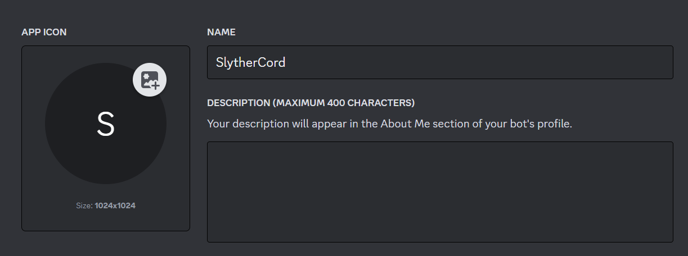

First of, I'd like to clarify some things.
This project is a **PoC (Proof of Concept)**. I didn't write the code for malicious intentions, but to see how far I can go with just my knowledge in Python and some help from friends.

Before you do anything stupid, please check the [legal section.](#legal)

If you get stuck somewhere along this journey, there will always be a Table of Contents on the right or just above this section, depending if you are on mobile.

## How did I start?

I knew I wanted to create something using **Python**, as I've been working with it for some while now and wanted to test what I could create with it.
I started with a new GitHub repository in my account and started installing things locally.

Don't forget to [follow my GitHub](https://github.com/isaaclins) and to ⭐ this project.




After that I started to plan what I wanted the bot to be able to do.

### Step 1 | Requisites

I wanted the bot to do the following:

- Have multiple connections at once
- Listen to commands
- Take screenshots of the current desktop
- See, Execute as well as delete files
- Upload/download external files
- Run a CLI command
- Access to webcam

With that part written down, I had to get access to a bot. 

### Step 2 | DDP

I started with a brand new application on [Discord Developer portal](https://discord.com/developers/applications) which looked like this:



After creating the app, I had to create the bot itself.


The next step was to reset the bot token and save it somewhere smart (definetly not the clipboard, like I did).
In my example I saved it inside another file called **settings.py**. More on that later.

### Step 3 | Coding

Coding the starting structure of the file was easily enough.
I made a new file called **settings.py** and **main.py**, where I added the base Discord communication import that goes as following:

```Python
import discord
from settings import bot_token # <--- see the imported settings?

intents = discord.Intents.all()
intents.members = True
client = discord.Client(intents=intents)

@client.event
async def on_message(message):
    print("message recieved")

@client.event
async def on_ready():
    print("ready")

client.run(bot_token)
```

⚆_⚆

I just figured that this code can also be used as a **Chat Logger**.

Maybe I'll do another project soon... Who knows!

Anyways, after making the file I wanted to see if it was possible for the bot to respond to a specific command I give him, so I started by filtering his own messages and only listen to other people.

```Python
@client.event
async def on_message(message):
    if message.author != client.user: 
        if message.content.lower() == "test":
            message.reply("custom message received!")
        else:
            message.reply("user replied with: " + message.content)


```

> The bot will respond with `"user replied with: {your_message}"` for any message you send, where `{your_message}` is replaced with the content of your message. However, if you send the specific message "test", the bot will respond differently, with the message `"custom message received!"`.

### Step 4 | Modules

I implemented some Modules that I found on **GitHub**, whilst coding some myself.


Click here to find the Documentation.


The coding itself was easy, as I could test it on myself on a different Python file and copy paste the working code.

### Step 5 | Testing

I tested everything locally on my own after putting in each module.

There really isn't much to say to this I am not going to lie.

## Documentation

### Modules

Here are the explanations for each Module:
| Name with Example Input   | Functioning Example Output                                                                                                  | Broken Example Output                                                                                 | Explanation                                                                                                                                                                                | Implemented |
|---------------------------|-----------------------------------------------------------------------------------------------------------------------------|-------------------------------------------------------------------------------------------------------|--------------------------------------------------------------------------------------------------------------------------------------------------------------------------------------------|-------------|
| `.help`                   | An embed titled "Help" with a description containing the list of commands.                                                  | No output if the commands cannot be fetched.                                                          | This module **displays a help message** with a list of commands.                                                                                                                           | ✅           |
| `.ping`                   | "Pong!  jk heres the latency: `{latency}ms`"                                                                                | No output if the latency cannot be fetched.                                                           | This module replies with the **latency of the client** in milliseconds.                                                                                                                    | ✅           |
| `.ls`                     | An embed titled "Files > {current directory}" with a description containing the list of files in the current directory.     | "Error" and "Directory Not Found" if the directory cannot be accessed.                                | This module **lists the files** in the **current working directory**.                                                                                                                      | ✅           |
| `.exit`                   | Deletes the channel and closes the client if the user reacts with "✅".                                                     | "You didn't react in time." if the user doesn't react in time.                                       | This module asks for confirmation before **deleting the channel** and **closing the client**.                                                                                            | ✅           |
| `.blue`                   | "Blue Successful!" or "Blue Failed! :("                                                                                     | "You didn't react in time." if the user doesn't react in time.                                        | This module asks for confirmation before attempting to trigger a **blue screen**.                                                                                                          | ❓           |
| `.ss`/`.screenshot`       | An embed titled "Screenshot" with the screenshot attached.                                                                  | Error message if the screenshot cannot be taken.                                                      | This module takes a **screenshot** and sends it as an attachment.                                                                                                                          | ✅           |
| `.photo`                  | An embed titled "[Image of User with ID: {mac_address}]" with the webcam photo attached.                                    | Error message if the photo cannot be taken.                                                           | This module **captures an image** from the **webcam** and sends it as an attachment.                                                                                                       | ✅           |
| `.purge`                  | "Purging..."                                                                                                                | Error message if the messages cannot be purged.                                                       | This module deletes all messages in the channel.                                                                                                                                           | ✅           |
| `.reload`                 | "reloading, please be patient..."                                                                                           | "You didn't react in time." if the user doesn't react in time.                                        | This module asks for confirmation before reloading the client.                                                                                                                             | ✅           |
| `.setVolumeToMax`         | "Volume is set to 100%"                                                                                                     | Error message if the volume cannot be set.                                                            | This module increases the volume to the maximum.                                                                                                                                           | ✅           |
| `.setVolumeToMin`         | "Volume is set to 0%"                                                                                                       | Error message if the volume cannot be set.                                                            | This module decreases the volume to the minimum.                                                                                                                                           | ✅           |
| `.admincheck`             | "Congrats, you're admin" or "Sorry, you're not admin"                                                                       | No output if the admin status cannot be checked.                                                      | This module checks if the user is an admin and sends a message accordingly.                                                                                                                | ✅           |
| `.location`               | "Here is the location: {link}"                                                                                              | Error message if the location cannot be fetched.                                                      | This module gets the location of the user and sends a link to it on Google Maps.                                                                                                           | ✅           |
| `.clipboard`              | "Clipboard content is : `{clipboard content}`"                                                                              | Error message if the clipboard cannot be accessed.                                                    | This module gets the **content of the clipboard** and sends it.                                                                                                                            | ✅           |
| `.wallpaper`              | "changed wallpaper"                                                                                                         | Error message if the wallpaper cannot be changed.                                                     | This module changes the wallpaper to an **attached image**.                                                                                                                                | ✅           |
| `.shell {command}`        | An embed titled "Shell > {current directory}" with a description containing the output of the command.                      | "No output" if the command has no output.                                                             | This module **executes a shell command and returns the output**. If there is no output, it returns "No output".                                                                            | ✅           |
| `.run {command}`          | An embed titled "Command Output" with a description containing the output of the command.                                   | An embed titled "Command Error" with a description containing the error message if the command fails. | This module **runs a command and returns the output**. If there is an error, it returns the error message.                                                                                 | ✅           |
| `.cd {desired directory}` | An embed titled "Changed Directory > {new directory}" with a description containing the list of files in the new directory. | "Error" and "Directory Not Found" if the directory cannot be changed.                                 | This module **changes** the current **working directory** to the specified directory and lists the files in the new directory. If the directory is not found, it returns an error message. | ✅           |
| `.input {keystrokes}`     | "Sent keystroke: {keystrokes}"                                                                                              | "Failed to send keystroke: {keystrokes} Error: {error message}" if the keystrokes cannot be sent.     | This module sends a **keystroke**. The user is asked to confirm before the keystroke is sent. If the user does not react in time, it sends a timeout message.                              | ✅           |
| `.type {content}`         | "Sent: {content}"                                                                                                           | "Failed to send keystroke: {content} Error: {error message}" if the content cannot be typed.          | This module **types a string as keyboard input**. The user is asked to confirm before the string is typed. If the user does not react in time, it sends a timeout message.                 | ✅           |
| `.say {content}`          | "just said ``{content}`` successfully"                                                                                      | Error message if the content cannot be spoken.                                                        | This module uses **text-to-speech** to say a **string**.                                                                                                                                   | ✅           |
| `.message {content}`      | No output.                                                                                                                  | Error message if the message box cannot be displayed.                                                 | This module **displays a message box** with a specified string.                                                                                                                            | ✅           |

### Functions

Here I'll dump the most important code parts and explain it line by line.

| Function name                             | Explanation                                                                                                                                                                                                                                                                                                                                                                                                                      | line |
|-------------------------------------------|----------------------------------------------------------------------------------------------------------------------------------------------------------------------------------------------------------------------------------------------------------------------------------------------------------------------------------------------------------------------------------------------------------------------------------|------|
| getTokenAndSearchForInfo()                | This function grabs the user token from the saved web-DB that saves the discord token and uses the implemented Discord API to grab any information it gets from the API. for example if the user has put a credit card, where country of the registered user is, email address and phone number of given account                                                                                                                 | 38   |
| setVolumeToMax()                          | This sets the volume of the client to the maximal possible using AudioUtilities.                                                                                                                                                                                                                                                                                                                                                 | 132  |
| setVolumeToMin()                          | This sets the volume of the client to the minimum possible using AudioUtilities.                                                                                                                                                                                                                                                                                                                                                 | 140  |
| find_channel_by_name(guild, channel_name) | This function iterates over all channels in a given guild and returns the channel that matches the provided name. If no match is found, it returns None.                                                                                                                                                                                                                                                                         | 193  |
| reload_program()                          | This function is used to restart the current Python script. It gets the path of the current Python executable and the script file, then uses the subprocess module to call the script again. After that, it exits the current script execution.                                                                                                                                                                                  | 198  |
| decrypt(buff, master_key)                 | This function attempts to decrypt a buffer using the provided master key and the AES encryption algorithm in GCM mode. If decryption is successful, it returns the decrypted string. If an error occurs during decryption, it returns the string "Error". **Please don't ask me where I got this from, as I've got ZERO memory of where I copied this from.**                                                                    | 203  |
| on_ready                                  | This is an event handler that gets called when the Discord client has finished connecting to the server. It calls the getTokenAndSearchForInfo() function, makes a request to **[ipapi.co/json](https://ipapi.co/json/)** to get location data, and then creates an embed message with various information. The embed message is then sent to a specific channel in a guild. If the channel doesn’t exist, it creates a new one. | 211  |
| on_message(message)                       | this handles the message that is send in chat. first it filters if the message has been sent by himself. After that it searches for the mac address of the client to match in which channel he should communicate in. after that it looks at the message content and does different things for different messages.                                                                                                               | 253  |

## Sources

- Hero background and image I found at [this blog](https://gettotext.com/beware-of-this-malware-on-discord-it-steals-your-bank-details-and-makes-purchases-without-your-knowledge/)
- Here is my GitHub Repository. If you want to improve or change some code, Please follow the article below on how to submit a PR.



## LEGAL



Copyright (c) 2024 Isaac Lins

SlytherCord is a tool developed by Isaac Lins. This software is provided "AS IS", without warranty of any kind, express or implied, including but not limited to the warranties of merchantability, fitness for a particular purpose and noninfringement. In no event shall the author be liable for any claim, damages or other liability, whether in an action of contract, tort or otherwise, arising from, out of or in connection with the software or the use or other dealings in the software.

This documentation provides an overview of the Discord Python RAT and its available features. It is important to use these functionalities responsibly and in compliance with relevant laws and regulations. Always ensure that you have appropriate authorization before remotely administering systems.

SlytherCord is intended for educational and responsible use only. The developer, Isaac Lins, takes no responsibility for any misuse of this tool. Unauthorized access to others' accounts, distribution of malware, or any other illegal activities are strictly prohibited. By using SlytherCord, you agree to comply with all applicable laws and regulations.

