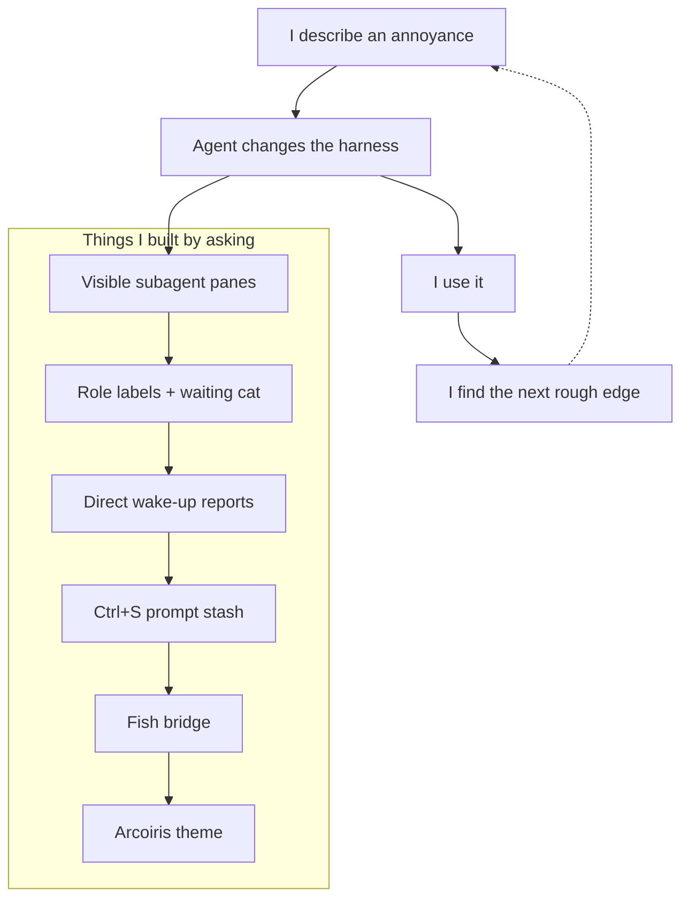

# Claude was not the bottleneck. Claude Code was.

Claude is still insanely good. I left Claude Code because the harness around it became the bottleneck, then built a setup I can actually change.

*Source: https://isaaclins.com/pr-preview/pr-66/blog/claude-code-was-the-bottleneck/*


I left [Claude Code](https://docs.anthropic.com/en/docs/claude-code/overview) for Pi even though Claude was not the problem.

Claude is still insanely good.

I just stopped believing another model release would fix the parts that kept annoying me. Claude Code made me notice the problem. The leaked OpenAI prompts show it is not just an Anthropic thing.

A harness is everything around a model that tells it how to work: rules loaded before your request, tools, memory, terminal, and how you get the answer back.

`agent = model + harness`

An agent is only as good as both parts. A good model still has to work inside that box.

## Claude was capable. I kept hitting the same wall

I had a familiar Claude Code loop. Give it a task. It does something impressive. Give it a bigger task and the same failure patterns come back.

Claude Code is customizable. It has `CLAUDE.md`, hooks, skills, and subagents. I could change notes and playbooks. But that still happened inside product boundaries Anthropic owns. I could not reshape the full system prompt, runtime, model routing, UI, delegation semantics, and feedback path as one coherent system.

In my workflow, delegated work too often became a task ID or a summary. Not a real visible process I could walk into. When it went down the wrong road, I got a finished summary and a pile of changes to inspect.

The model was not suddenly stupid. The setup kept repeating the same bad situations.

I stopped waiting for the next benchmark bump. I changed the setup around it.

I moved the work into [Pi](https://github.com/earendil-works/pi-mono), gave it the rules and tools I actually wanted, and kept useful context close to the project. The repeated failure patterns reduced. No model weights improved.

My honest take: **70% of good agent work is setup.** Obviously, that is not a real benchmark. It is what the last few months felt like: most of the difference was setup, not swapping one frontier model for another.

The boring bits made the difference. A system prompt is the rules loaded before your request. In Pi, those rules are mine. I do not need a coding model carrying a generic app's personality into every job.

Memory is just facts kept between sessions: how this repository works, what we decided, the weird exception nobody remembers until it breaks. Skills are reusable playbooks. “Before touching this deployment, check these files.” The model still thinks. It stops inventing the process from scratch.

Then there is visibility. An agent that disappears is hard to correct. An agent in a pane next to me is a process I can watch, interrupt, and steer before it wastes another ten minutes.

A slightly weaker model in the right setup can beat a stronger one in the wrong setup. Not every time. Enough times that I care more about setup than the leaderboard.

## The leaked prompts are the clearest proof

The latest leaked prompts we can inspect are unofficial snapshots, not confirmed current OpenAI internals. They are still useful.

One [GPT-5.6 Sol Extra High / ChatGPT snapshot](https://github.com/asgeirtj/system_prompts_leaks/blob/main/OpenAI/gpt-5.6-sol-extra-high.md) is about **115 KB**, roughly **17,124 words**, and starts with `Current date: 2026-07-10`, six days before this post. It says:

> “You must use a stock price chart widget if the user requests or would benefit from seeing a graph...”

That rule will not fire while somebody is reverse-engineering a binary in `Ghidra`. That is not the point. The point is that a model doing unrelated engineering work has to carry stock-chart and image-carousel product policy in its working context at all.

That is what a harness can do. It loads irrelevant rules before the work starts, narrows behavior, and makes a general model act like one product.

There is a separate [GPT-5.6 Codex leak](https://github.com/asgeirtj/system_prompts_leaks/blob/main/OpenAI/Codex/gpt-5.6.md), around **16 KB** and **2,604 words**. Not the source of that quote. Different product.

Those are the files. Here is my take: Codex's system prompt remains the bottleneck of the GPT 5.6 family. The models are getting better faster than the wrappers around them are learning when to shut up.

## I did not build a model. I assembled a workshop

Did I build it from scratch? Kinda.

I did not write the model, terminal, multiplexer, or shell. I chose parts with clear jobs and wrote the missing glue.

Most of it came from describing an annoyance, using the change, then finding the next rough edge. Not one prompt. Lots of small asks.



Pi is the replaceable model and agent runtime. In normal words: it talks to Claude or another model, lets it read files and run commands, and gives me extension points to change the rules. I control the system prompt, tools, skills, memory, delegation, and model choice.

[tmux](https://github.com/tmux/tmux) owns persistent processes and panes. Each agent gets its own persistent pane with a full terminal. A child is a visible process I can click into, type to, interrupt, or keep around.

[Ghostty](https://ghostty.org/) owns the terminal window itself: rendering, mouse clicks, text selection, and links. It forwards my split shortcuts into tmux, so I do not end up with Ghostty panes fighting tmux panes. Plain clicks select tmux panes. Shift-drag selects text. Cmd+Shift+click opens links.

[Fish](https://fishshell.com/) owns my interactive shell. It contains years of shortcuts and little functions I use without thinking. Pi's shell tools still use Bash because Bash compatibility matters for normal commands and scripts. The Fish bridge exposes selected Fish functions instead of pretending the two languages are interchangeable. They are not.

The glue does one useful thing too: when a child finishes, it reports to the parent and wakes it up. I do not babysit a task ID. The [implementation is public](https://github.com/isaaclins/pi-terminal-kit).

## The result is boring. It just works

The tmux border says `◆ ORCHESTRATOR` for the parent, `◆ SUBAGENT` for a child, and `• SHELL` for a normal terminal. That is enough to stop me staring at the wrong pane for five seconds.

A little waiting cat appears while the parent waits. When the child finishes, the parent wakes up. If it is doing something dumb, I can type into its pane. If it is fine, I leave it alone.

Ctrl+S stashes the half-written prompt in my editor. An agent can finish in the middle of my next thought without deleting it. That feature is still local and maybe an upstream Pi candidate later. It is not part of the public package.

The `Arcoiris` theme makes status and warnings easier to scan. Ghostty and tmux agree about clicks. Fish shortcuts are still there. None of this makes Claude smarter. It makes the work around Claude less annoying.

I wrote about the original [Ghostty X Fish setup](/blog/ghostty-fish-perfect-combination/) before agents took over my terminal. It matters more now. And once you have several agents changing one repository, you run into the next problem: [Git was not built for agents](/blog/git-wasnt-built-for-agents/).

## Do not copy this unless you want the control

Claude Code is still the better default for most people. It is easier. If it fits your work, use it.

My setup cost time and broke repeatedly. I enjoy shaping tools and get the time back. That may not be true for you.

This is not an anti-Anthropic post either. Claude stays available in Pi. Pi means I can use Claude today, another model for a different task tomorrow, and keep the rules around both.

I open-sourced the reusable pieces in [**pi-terminal-kit**](https://github.com/isaaclins/pi-terminal-kit): [visible Pi and tmux co-driving](https://github.com/isaaclins/pi-terminal-kit/tree/main/packages/pi-codrive), the [Fish bridge](https://github.com/isaaclins/pi-terminal-kit/tree/main/packages/pi-fish-bridge), the [`Arcoiris` theme](https://github.com/isaaclins/pi-terminal-kit/tree/main/packages/pi-arcoiris-refined), and the [Ghostty/tmux/Fish recipe](https://github.com/isaaclins/pi-terminal-kit/tree/main/recipes/ghostty-tmux-fish). Windows is unsupported. The README has local testing and technical details.

Install the packages with:

```sh
pi install npm:@isaaclins/pi-codrive@0.1.0
pi install npm:@isaaclins/pi-fish-bridge@0.1.0
pi install npm:@isaaclins/pi-arcoiris-refined@1.0.0
```

Models will keep getting better. Good. I just do not want the people building the wrapper to decide how I am allowed to use them.


